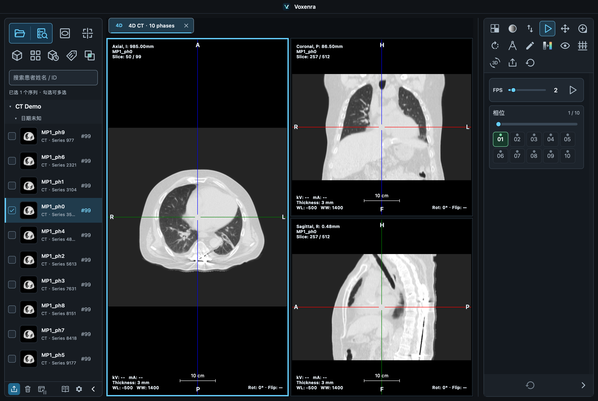

<p align="center">
  
</p>

# Voxenra

跨平台 DICOM 影像工作台，支持本地文件、文件夹、压缩包与 PACS 导入，提供 CT / MR / PET 的 2D 阅片与 MPR、CT / MR 序列平铺、CT 4D、CT / MR / PET 三维体绘制、PET/CT 融合、测量标注与影像导出。

## 下载

| 平台 | v1.0.1 下载 |
| --- | --- |
| macOS · Apple Silicon | [DMG 安装包](https://github.com/l5769389/voxenra/releases/download/v1.0.1/Voxenra-1.0.1-macos-arm64.dmg) |
| Windows · x64 | [安装包](https://github.com/l5769389/voxenra/releases/download/v1.0.1/Voxenra-1.0.1-windows-x64-setup.exe) · [便携版](https://github.com/l5769389/voxenra/releases/download/v1.0.1/Voxenra-1.0.1-windows-x64-portable.exe) |

[查看 v1.0.1 主要更新](https://github.com/l5769389/voxenra/releases/tag/v1.0.1)

v1.0.1 修复平铺首格加载与鼠标指针重叠，统一弹窗操作，重做导入结果界面，并清理旧图标与冗余代码。

# 常规功能
- 常见的数据加载方式： 本地文件、文件夹、拖拽
- 常规 CT / MR / PET 的 2D 阅片与 2–4 序列对照，支持调窗、翻页、平移、翻转、缩放、伪彩、测量和导出
- CT / MR 序列平铺，支持同步显示与翻页；双击切片进入 2D 测量，PET 暂不开放平铺
- 规则 CT / MR / PET 体数据的 MPR，支持测量、十字线定位、切面旋转与厚层投影；MR 暂不开放分割及 VOI
- 常规 CT / MR / PET 影像的 3D 视图，支持旋转、缩放、平移、裁剪等
- PET-CT的融合视图，支持MPR各个切面的融合、3D融合、手动配准等功能
- TAG浏览器

# 特色功能
- 支持压缩文件和常规文件的混合导入
- 支持一些常用的服务工具：MTF、FWHM、水模QA的计算
- 序列、单张影像的匿名导出
- 支持PACS系统的配置和导入


## 当前支持的影像

以下描述**当前源码版本**。MR 基础支持是本次新增功能，尚未包含在上方 v1.0.1 安装包中。

| 影像类型 | 输入范围 | 可用视图与操作 | 主要限制 |
| --- | --- | --- | --- |
| CT | 常规单帧灰度 DICOM CT | 2D、平铺、Compare 2D、MPR、3D；有效 CT 相位组可用 4D；可与 PET 融合 | MPR / 3D 要求规则几何，4D 还需通过时相与跨相位几何检查；增强多帧不在当前重建范围 |
| MR | 经典单帧 MR、Enhanced MR 和 Legacy Converted Enhanced MR，单采样 MONOCHROME1／MONOCHROME2 | 2D、平铺、2–4 序列对照；规则组支持 MPR、3D 与 MPR 四宫格；自动分组、调窗、测量和导出 | Mosaic、彩色、波谱、MR 4D 播放、融合及定量分析未开放；缺失维度不猜测，重建需规则几何 |
| PET（DICOM 模态 PT） | 经典 PET Image Storage，单帧 MONOCHROME2，SeriesType 为 STATIC / IMAGE 或 WHOLE BODY / IMAGE | 2D、Compare 2D、MPR、独立 3D、PET/CT 融合与融合 3D；按元数据提供源单位或 SUV | 不开放 PET 平铺、4D；不支持动态／门控、Enhanced PET 和多帧 PET；缺少必要元数据时不提供 SUV 换算 |
| 其他 DICOM 模态／对象 | 可识别的 DICOM 文件 | 可读取对象的 Tag；部分可解码的单帧灰度图像可走通用 2D 路径 | CR、DX、US、XA 等尚未完成专项验证，不承诺完整阅片、测量或重建；不支持 SR、SEG、RTSTRUCT 的专用处理 |

**MR 复用现有视图页签**，不需要独立 MR tab。工具随模态调整：保留通用浏览与测量按钮，增加自动窗，隐藏 CT 组织窗模板、MTF／水模 QA、分割、VOI 和去床板。MR 强度没有通用 HU 刻度，未明确单位时显示 **a.u.**；显示已有 ADC 图不代表具备 ADC 计算或定量换算能力。

**重建条件**：至少两张切片，矩阵、像素间距、方向和参考坐标系一致，位置完整、无重复且规则排列。MR 还检查回波、扩散编码、时相与图像分量是否混杂，定位像不进入 MPR。同一 Series 中有明确维度信息的 MR 自动拆分浏览组；缺少维度信息时不猜测，重复位置不开放重建。

**文件与解码范围**：文件名不要求 `.dcm` 后缀；主阅片支持已列明的单帧灰度影像及灰度 Enhanced MR。导入列表、Tag 浏览或逐帧 PNG 导出能处理某个对象，并不表示主阅片支持该多帧／彩色格式。未压缩和 RLE 为基础解码范围，JPEG、JPEG-LS、JPEG 2000 等取决于运行环境可用的像素解码器；ZIP 等归档解压与像素解码是两回事。NIfTI（`.nii` / `.nii.gz`）、NRRD、厂家原始 MR 数据不是当前输入格式。

操作入口见软件内 **手册 → 快速开始 → 支持的影像与格式**；MR 细节见 [MR 基础阅片](docs/mr.md)，公开样本及测试步骤见 [MR 测试数据](docs/mr-test-data.md)，实际影像操作与修复记录见 [MR 界面复核](docs/mr-ui-review-20260914.md)。

## 文件加载与数据源

### 本地文件、文件夹与拖拽

点击首页或左侧栏的 **打开影像**，或按 `Ctrl+O`（macOS 为 `⌘+O`），在同一个选择窗口中选择文件夹、DICOM 文件和压缩包，无需先切换导入类型。

- **混合多选**：按住 Ctrl / ⌘ 可同时选择多种项目，点击「打开所选」一次导入。例如同一目录中的一个 CT 文件夹、一个 PET 压缩包和若干 DICOM 文件。
- **文件夹导入**：递归扫描子文件夹，按影像中的患者、检查与序列信息组织列表。双击文件夹进入浏览；未选中项目时，可直接打开当前文件夹。
- **文件导入**：支持单个或多个 DICOM 文件，按内容识别，不要求带有 `.dcm` 后缀；具体阅片范围见上方「当前支持的影像」，主阅片不支持通用多帧对象。
- **拖拽导入**：可将文件、文件夹及压缩包一起拖入应用窗口，也可直接拖到 CT、PET 或融合的原生 3D 画面。
- **路径定位**：选择窗口支持输入路径、返回上一级、主目录和计算机位置。
- **后台处理**：独立任务窗口显示枚举、解压和读取进度，期间可继续使用已打开的视图；任务窗口和导入入口均可取消。失败显示原因并支持重试 / 重新选择。单批最多 100,000 个文件，超限可按患者或检查分批导入。重复导入按序列、实例 UID 与帧号合并，同序列新增切片追加到已有列表项。

### 压缩包导入

| 类型 | 支持格式 | 说明 |
| --- | --- | --- |
| ZIP | `.zip` | 可包含多个文件及多层文件夹 |
| RAR | RAR4、RAR5 | 支持固实压缩与中文文件名，解包库随应用提供，无需安装 WinRAR |
| 7-Zip | `.7z` | 解压后递归扫描 DICOM |
| TAR 归档 | `.tar` | 支持归档内的目录结构 |
| 压缩 TAR | `.tar.gz` / `.tgz`、`.tar.bz2` / `.tbz2`、`.tar.xz` / `.txz` | 解压后扫描其中的文件 |
| 单文件压缩 | `.gz`、`.bz2`、`.xz` | 解压单个文件后识别影像 |

支持有限层数的嵌套压缩包；当前不支持加密包与分卷包。压缩包解压到本次会话的临时目录，不改动源文件，正常退出时清理。这里的压缩支持指文件与文件夹归档；DICOM 像素编码的可读范围仍取决于现有解码器。

格式限制、取消行为及缓存说明见 [本地导入](docs/local-import.md)。

### PACS / DICOMweb

在 **设置 → 数据源** 添加 PACS 连接，再从首页或侧栏打开 **PACS 浏览器**。本地文件与 PACS 可同时启用，也可按使用场景隐藏其中一种入口。

- **连接配置**：支持多个服务地址、启用 / 停用、默认连接、编辑、删除与连接测试；认证方式包括无认证、Basic 和 Bearer，可设置网络超时。
- **查询影像**：按患者姓名、患者 ID、检查号、模态、日期等条件查询检查，再浏览对应序列；支持分页、序列多选与全选本页。
- **下载导入**：点击「导入所选」后在后台下载、校验与扫描，支持进度显示和取消；成功后加入左侧列表，并打开首个序列的 2D 视图。
- **继续处理**：PACS 导入的序列可使用与本地序列相同的阅片、重建和导出入口，具体视图取决于影像本身是否满足要求。
- **协议范围**：使用 QIDO-RS 查询、WADO-RS 下载，适用于启用 DICOMweb 的 Orthanc、dcm4chee 及兼容服务。当前不提供传统 DIMSE 的 C-FIND / C-MOVE / C-GET，也不向 PACS 上传或修改数据。

连接参数会保存；密码和 Bearer 令牌仅保留在当前会话，重启后需重新填写。配置步骤见 [PACS 使用说明](docs/pacs.md)。

## 序列列表与工作区

- 左侧按 **患者 → 检查 → 序列** 分组，显示缩略图、模态和切片数量，支持按患者姓名 / ID 搜索、折叠分组、复选框及 Ctrl / ⌘ 多选。
- 单击选择、双击打开 2D；通过顶部图标或右键菜单打开平铺、MPR、3D、4D、DICOM 标签及融合视图。同一序列的同类视图重复打开时激活已有页签。
- 右键支持移除当前序列、删除所有勾选序列、定位源文件和整序列匿名导出；底部清除按钮移除所有载入项，包括搜索隐藏项。**列表移除不删除源文件，也不关闭已打开的视图。**
- 顶部导航与底部操作栏固定，中间列表滚动；收起后保留紧凑缩略图栏，继续支持选择、双击与右键菜单，并保留数据源入口、手册和设置。
- 右侧工具栏及设置页导航可拖动调整宽度，重启后保留。不同视图的共同工具保持相近顺序，重置位于最后。
- 视图首次打开显示加载状态，支持取消打开与失败重试；切换页签保留各自的影像显示、视角与操作状态。

## 阅片与重建

### MR 基础阅片

支持经典与 Enhanced MR，按回波、b 值、扩散方向、时相及分量自动拆成独立浏览组。2D 默认从中间层打开，支持来源窗值／自动窗、反白和基础测量；MPR 使用完整体的初始强度范围。规则组可打开 3D 及 MPR 四宫格，使用 MR 专用灰度、高信号和 MIP 预设。来源强度未注明单位时显示 a.u.；不套用 CT HU 或执行 MR 定量换算。详细范围见 [MR 支持](docs/mr.md)。

### 2D 阅片与 CT 调窗

- 支持滚轮翻页、拖动翻页、平移、缩放、旋转 90°、水平 / 垂直翻转与伪彩显示。
- 翻页面板提供 **第一页、最后一页、向前 10 页、向后 10 页**；缩放面板提供 **1×、2×、5×、10×**，1× 为默认适配大小。
- CT 可拖动调窗，或输入 WW / WL 后按回车、点击「应用」提交；编辑途中不改变影像，数值最多保留一位小数。
- 内置脑组织、肺窗、骨窗、软组织窗；支持保存、启停、编辑和删除最多 20 个自定义窗模板，重启后保留。
- CT 的 2D、平铺、MPR、4D 与融合切片提供 **反白**；融合中仅改变 CT 层。反白、调窗及伪彩只改变显示，不改写原始像素与测量统计。


### 序列 2D 对比（2D Compare）

- 勾选 **2–4 个序列**后右键选择 **序列 2D 对比**，或在弹窗中选择另外 1–3 个；两组左右排列，三／四组使用四宫格。
- MR 默认独立调窗和反白，并按**患者坐标**联动：同一检查、相同 Frame of Reference 的平行序列在覆盖范围内同步翻页。不同方向可显示定位线，**Alt＋单击**定位对应点；不匹配的空间保持独立，不执行配准。
- 在 **视口设置 → 对比同步操作**中切换为**相对进度**，并分别设置翻页、窗值、平移、缩放等同步项。相同进度不代表同一解剖位置。
- 测量和标注各自独立；工作区保存所有视口状态及联动方式，当前 PNG 导出使用选中视口。
- 快捷键 **⌘D（macOS）/ Ctrl+D（Windows）**：选中 2–4 组时直接打开，一组时打开选择器，未选时使用当前视口。支持撤销重做、测量报告与独立窗口；切换同步项时以活动视口为准。

### 序列 MPR 对比（MPR Compare）

- 右键两组可重建序列选择 **序列 MPR 对比**，或从一组选择另一组。六宫格上排 A、下排 B，按 Axial / Coronal / Sagittal 对应排列。
- 两组默认独立定位、旋转、调窗、平移和缩放。双击切面并排放大对应切面，再次双击返回；右侧首个布局工具也可切换。
- **位置联动**与**旋转联动**分别开启，默认关闭。开启时保持现有位置与方向，只同步后续的相对位移或旋转，方便先分别定位再共同浏览；本功能不进行配准。
- 六个切面各自保留测量与标注，支持撤销重做、测量报告与工作区恢复。恢复包括两组几何与显示状态、当前视口、布局及联动设置。

- 顶部常驻位置、旋转、CT 调窗和物理比例开关。调窗同步采用当前序列窗值且保留各自反白；物理比例同步让对应切面以相同毫米比例显示，并随窗口和布局变化保持一致。
- 切面或厚层超出数据范围时显示明确提示，可一键返回本序列中心而不移动另一组。

### 序列平铺

每行可显示 **2～6 张切片**，默认 4 张，滚动时按可见范围加载。调窗、伪彩、反白、平移、缩放与旋转统一应用到各张切片。

顶部序列详情可展开 / 收起，收起后保留标题、切片数、窗值、模态与列数选择；每格仅保留切片信息。双击某张切片打开对应 2D 视图并定位到该层，继续进行测量与标注。

### MPR 与 4D

- **CT MPR**：轴位、冠状位、矢状位三视图联动定位；支持十字线移动、斜面重建、切面旋转、厚层投影和三维方向调整。
- **独立 PET MPR**：单独选择静态 PET 序列即可打开三视图，无需 CT；三个方向共享定位、PET 显示范围与可用单位。
- **CT / MR 调窗同步**：同一 CT / MR MPR 或 CT 4D 页签中的三方向同步窗值和反白，其他页签独立；调窗重置统一恢复初始值。
- **4D MPR**：对支持的多时相 CT 提供相位选择、滑块和循环播放，播放速度 1～15 FPS；切换时相保留定位和显示设置。
- **MPR 布局**：右侧可选横向三列、纵向三行、左右／上下主视图和含 3D 的四宫格，CT、MR、独立 PET MPR 和 CT 4D 支持全部七种布局。3D 显示切面边框与交点，拖动交点同步定位；支持可选的双向旋转联动，默认独立观察。布局和 3D 显示状态随工作区保存。

MPR 与 3D 需要可构建规则体数据的序列；4D 还需要有效的时相分组。数据不满足条件时入口禁用或显示具体加载原因。




### CT 与独立 PET 3D

| 视图 | 显示控制 | 编辑与导出 |
| --- | --- | --- |
| CT 3D | 通用、MIP、XRay、骨骼、肺和血管预设；CT 窗值调整 | 去床板、自由圈选内部 / 外部裁剪、裁剪重置、PNG 导出 |
| 独立 PET 3D | 可用单位、显示上限、低值隐藏阈值、色表与不透明度 | 自由圈选内部 / 外部裁剪、裁剪重置、PNG 导出 |

两种视图均支持旋转、平移、缩放、六个标准观察方向和整体重置。独立 PET 3D 可直接从 PET 序列打开，支持小于 1 的显示数值，切换单位时换算显示上限与阈值；单位或色表切换保留裁剪。

裁剪和去床板仅影响当前页签的显示，源文件保持不变。3D 使用方向立方体提示朝向，不显示四角文字，也不提供反白；三维渲染结果可导出 PNG，不作为新的重建 DICOM 导出。


### PET/CT 融合与手动配准

勾选一个 CT 和一个 PET 序列即可进入融合；只选一个序列时可从配对窗口选择互补序列，并核对患者与检查信息。

- **四格联动**：CT、PET、融合与 PET MIP，支持轴位 / 冠状位 / 矢状位切换和物理位置联动；点击有效 MIP 像素可定位到对应热点位置。
- **独立显示**：CT 使用 WW / WL，PET 使用显示强度上限；可分别调整 PET / MIP 和融合层色表，以及 PET 叠加比例。
- **单位与统计**：依据实际元数据提供可用的 SUV 或活度单位；融合切片可读取 CT / PET 光标值及两套 ROI 统计。
- **手动刚性配准**：通过鼠标拖动或三轴平移、旋转数值调整 PET 相对 CT 的位置，提供中心对齐与配准重置。
- **融合 3D**：从融合工作区打开独立三维页签，切换 CT、PET 或融合显示，分别设置组织预设、色表、阈值与不透明度，并同步二维已应用的配准。

PET 重建当前面向经典单帧静态 / 全身 PET，不包含动态或门控 PET、Enhanced PET、自动配准或非刚性配准。详见 [PET 与融合](docs/pet-mpr-fusion.md)。


## 工作区保存与恢复

左侧底部工作区图标提供保存、另存为与恢复。`.voxworkspace` 保存影像引用及操作状态，不复制整套 DICOM：包括序列选择、页签顺序与布局、切片／时相、窗值、MPR 平面、PET 显示、已完成测量／标注、VOI／分割和 3D 裁剪。压缩包恢复时重新解压；PACS 引用本机下载文件。来源移动后可重新定位，并核对 UID 和几何信息。

工作区每 30 秒保存意外退出恢复副本；下次启动可选择恢复。Ctrl/⌘+S 保存，Ctrl/⌘+Shift+O 打开工作区。测量等已完成编辑支持页签独立撤销／重做；关闭页签后不保留撤销历史。详细范围与操作见 [工作区说明](docs/workspaces.md)。

## 页签与多窗口

页签支持右键关闭、关闭其他／右侧／全部，左键拖动排序、中键关闭。拖出窗口可独立阅片，再拖到另一个页签栏合并；影像、测量、裁剪及撤销历史随页签保留。独立窗口只显示页签、内容和右侧工具，右上角可返回主窗口。Ctrl/⌘+W 关闭当前页签，Ctrl+Tab／Ctrl+Shift+Tab 切换页签。工作区保存包含所有窗口，恢复时统一放回主窗口。

## 测量、标注与分析

### 测量与标注

- **基础测量**：长度、角度、矩形 ROI、椭圆 ROI；可显示面积、宽高、均值、标准差、最小 / 最大值与像素数，统计来自原始模态像素。
- **绘制与编辑**：完成绘制后进入「选中已完成」状态；点击已有对象进入「选中草稿」编辑状态，可移动整体或调整控制点。支持 Esc 取消本次绘制 / 编辑、Delete / Backspace 删除所选对象。
- **两类标注**：纯箭头、文字箭头，均可设置颜色、线宽与箭头大小；文字箭头另提供文字与字号。
- **复制粘贴**：选中测量或标注后使用 `Ctrl+C` / `Ctrl+V`（macOS 为 `⌘+C` / `⌘+V`），在当前切片生成可独立编辑的副本；跨视口粘贴按目标间距和像素重新计算数值。
- **样式与保存范围**：绘制 / 编辑和完成样式可分别配置，支持颜色、实线 / 虚线、线宽与字号；样式偏好持久化，已完成的测量与标注可随工作区保存；支持页签内撤销／重做。

### MPR 阈值分割与 VOI

在支持的 CT / PET MPR 及融合切片中，可绘制矩形柱体范围进行阈值分割，或建立球体 / 椭球 VOI。支持绝对值与百分比阈值、范围深度 / 直径调整、移动、显隐、改名与删除，并计算体积、体素数和强度统计。

范围及定量结果保留在当前页签；PET MIP 不提供此类绘制和定量。当前不支持自由手绘三维分割或 DICOM SEG / RTSTRUCT 交换。详见 [分割与 VOI](docs/mpr-segmentation-voi.md)。

### 服务分析

| 工具 | 功能 |
| --- | --- |
| MTF 点源分析 | 在原始 2D 切片选择微珠或细丝截面，使用直接 FFT 或高斯拟合，查看 X / Y 曲线、MTF50、MTF10 与 FWHM |
| CT 水模 QA | 自动识别水模、建立中心及四周共 5 个圆形 ROI，调整直径、边距或拖动 ROI，查看水 CT 值、噪声、均匀性、区域一致性及各 ROI 统计 |

分析在后台执行，水模 QA 支持切片结果缓存、重新识别和重置。面板提供对应手册入口，说明操作步骤与指标含义；分析结果不自动判定设备是否合格。水模 QA 详情见 [操作与指标说明](docs/water-qa.md)。

### DICOM 标签浏览

在独立 Tag 页签中逐实例浏览元数据，展开嵌套序列，按标签编号、名称、关键字或值搜索。标签按需读取，可与影像页签切换使用。双击标签查看完整值，短值紧凑显示，长值可滚动、选择或一键复制。

## 导出

| 入口 | 内容与格式 |
| --- | --- |
| 左侧「导出序列」 | 可选 DICOM 或逐帧 PNG；MR 的 PNG 仅含当前组，DICOM 保留完整多帧源对象 |
| 序列右键「脱敏导出整个序列」 | 仅导出右键目标序列，匿名选项固定开启 |
| 右侧「导出 PNG」 | 导出当前视口画面；平铺为当前可见工作区，3D 为当前原生渲染结果，包含裁剪效果 |
| 右侧「测量 CSV / PDF」 | 导出当前页签或全部页签的已完成测量、标注及 VOI 统计；PDF 可附当前切片参考图，默认匿名 |
| 右侧「导出 DICOM」 | 在支持的视图中导出源 DICOM，不将 MPR 或三维画面转换成新的重建 DICOM |

- **匿名默认开启**：DICOM 清理身份元数据并映射 UID；匿名视口 PNG 隐藏四角身份文字、自由文字标注和平铺患者详情，保留测量及箭头几何。取消匿名后可保留原身份信息。
- **序列 PNG 与截图分别导出**：整序列 PNG 使用源影像分辨率与灰阶变换，不包含当前视口的伪彩、缩放、测量或重建效果；需要保留显示效果时使用右侧 PNG 截图。
- **导出目录**：在设置中保存全局序列导出位置，每次生成独立子目录，默认位于系统文档目录下的 `Voxenra/Exports`。

匿名导出不会自动擦除影像像素中烧录的文字或人脸；源文件明确声明此类身份内容时会拒绝匿名导出。具体处理范围见 [导出说明](docs/export.md)。

## 显示设置与离线手册

设置页支持搜索分类并自动保存偏好，包括数据源、导出目录、普通影像 / PET 默认伪彩、自定义窗模板、十字线、四角信息、比例尺、测量标注与 ROI 指标。

**设置 → 外观与语言** 可即时切换深色／浅色及简体中文／English，保留当前页签、影像、测量与撤销记录。首次安装和旧配置仍默认深色、简体中文。操作界面、提示、手册与测量报告提供中英文；英文手册配有合成影像的软件截图。

语言使用可编辑的 UTF-8 JSON 包，可打开语言包目录修改译文、添加新语言，再点击“重新加载语言包”应用，无需重新编译。模板、占位符和错误恢复方法见 [语言包编辑说明](docs/language-packs.md)。

四角信息可逐角选择字段和排序，控制字体、颜色及显隐；小视图自动缩小文字，超长内容单行省略。比例尺按物理间距、缩放和可用空间自动选取长度，可设置物理长度上限。平铺仅显示切片信息，3D 使用方向立方体。

左侧书本按钮打开随应用提供的 **离线操作手册**，支持章节搜索、工具面板直达和阅读位置保留，无需联网或先加载影像。查看手册后返回影像，可继续此前的操作。

## 从源码运行

在项目目录执行：

```bash
uv run voxenra
```

开发与验证：

```bash
uv run --group dev pytest -q
uv run python tests/manual/smoke_3d.py
```

[本地导入](docs/local-import.md) · [PACS](docs/pacs.md) · [显示设置](docs/display-settings.md) · [操作手册](docs/manual.md) · [PET 与配准](docs/pet-mpr-fusion.md) · [分割与 VOI](docs/mpr-segmentation-voi.md) · [导出](docs/export.md) · [打包与发布](docs/packaging.md)

MR 分组导出：PNG 仅导出当前浏览组；DICOM 保留完整原始对象，可能包含其他回波／时相／分量，导出弹窗会说明。公开多厂家样本与参考结果见 [MR 测试数据](docs/mr-test-data.md)。
