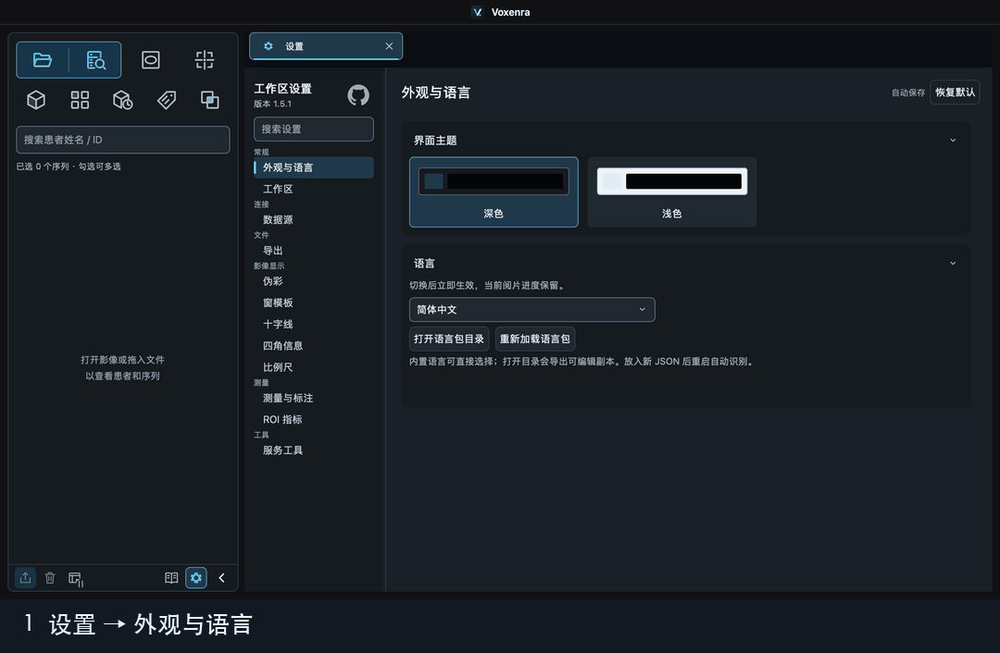

# 外观与语言

设置 → 外观与语言可即时切换浅色／深色和简体中文、English、Português (Brasil)，也可选择用户添加的语言。初次安装与旧配置保持深色、简体中文。偏好保存到现有设置的 `appearance.theme`、`appearance.language`，不修改影像、测量、撤销记录或工作区状态。

## 内置语言与本地语言包

随应用发布的 JSON 属于**内置语言包**，无需出现在用户目录也能直接选择。本次合并的 `pt-BR.json` 是巴西葡萄牙语（Português (Brasil)），不是西班牙语。点击“打开语言包目录”时，软件会把缺少的内置包导出为可编辑副本，包括 `pt-BR.json`；已有文件不会被覆盖。未经修改的导出副本不会遮盖以后随软件更新的译文。

本地 `languages` 目录也接收用户自行安装的语言包。把 JSON 文件放入目录并重启软件，它就会出现在语言选项中；编辑后也可点击“重新加载语言包”。

## 新增语言教程：以西班牙语为例



1. 进入 **设置 → 外观与语言**，点击 **打开语言包目录**。
2. 在打开的目录中新建 `es-ES.json`。可以复制 `en-US.json` 作为完整翻译模板，再把文件名、`locale` 改成 `es-ES`，将 `name` 改成 `Español`，删除复制来的 `_builtinTemplateDigest` 字段。已有语言包不要直接改名。
3. 用 UTF-8 编辑 `messages` 中的译文。也可以先用下面的最小示例测试；尚未翻译的条目会显示英文。
4. 保存后重启软件，在语言列表中选择 **Español**。选择会立即生效并在下次启动时保留。修改译文时可用 **重新加载语言包**，不用再次重启。

翻译 `messages` 时保持文案 ID 和占位符名称、格式不变，例如 `{value1}`、`{count}`；不要将参数翻译成其他名字。手册也在语言包中，`**重点**` 与反引号保留重点和快捷键样式。

```json
{
  "formatVersion": 1,
  "locale": "es-ES",
  "name": "Español",
  "messages": {
    "text.0539": "Cancelar",
    "sidebar.selected": "{count} series seleccionadas"
  }
}
```

文件名必须与 `locale` 一致。用户修改的同语言外部包优先于内置包；省略的条目回退到内置同语言，新语言回退英文。无效 JSON、语言标识或占位符会在设置中报告，保留最后有效内容。修正后重新加载；也可移走有问题的外部文件，重新加载以恢复内置包。

## 通过 PR 增加内置语言

贡献者提交的新语言 JSON 应放在 `src/qt_dicom_viewer/qml/assets/languages/`，并在 `Voxenra.qrc` 中登记。应用会扫描该目录，读取文件名、`locale` 和 `name`，无需另改固定语言列表。打包流程会收集该目录的文件，`tests/test_appearance_language.py` 会检查每个内置包的元数据、占位符及打包资源。用户目录只存放个人添加或编辑的副本，不是 PR 语言包的源码位置。

数据目录通常为：

- macOS：`~/Library/Application Support/Voxenra/Voxenra/languages`
- Windows：`%LOCALAPPDATA%\Voxenra\Voxenra\languages`

以软件“打开语言包目录”实际打开的位置为准。患者姓名、路径、用户命名和自由标注不会被翻译。应用拥有的提示与按钮跟随所选语言；系统文件选择窗口的系统侧栏跟随操作系统语言。

CSV 的可读列名、测量类型和 PDF 正文随导出开始时的语言固定，导出期间切换语言不会混用。数据、列顺序、单位及匿名规则保持一致。PDF 保持适合打印的浅色页面。

开发校验：`tests/test_appearance_language.py` 检查内置包完整性、参数、覆盖、回退、持久化和实时界面切换。`tests/manual/capture_manual.py OUTPUT --english` 使用合成 CT/PET 和真实 Qt/VTK 窗口生成英文手册截图。
