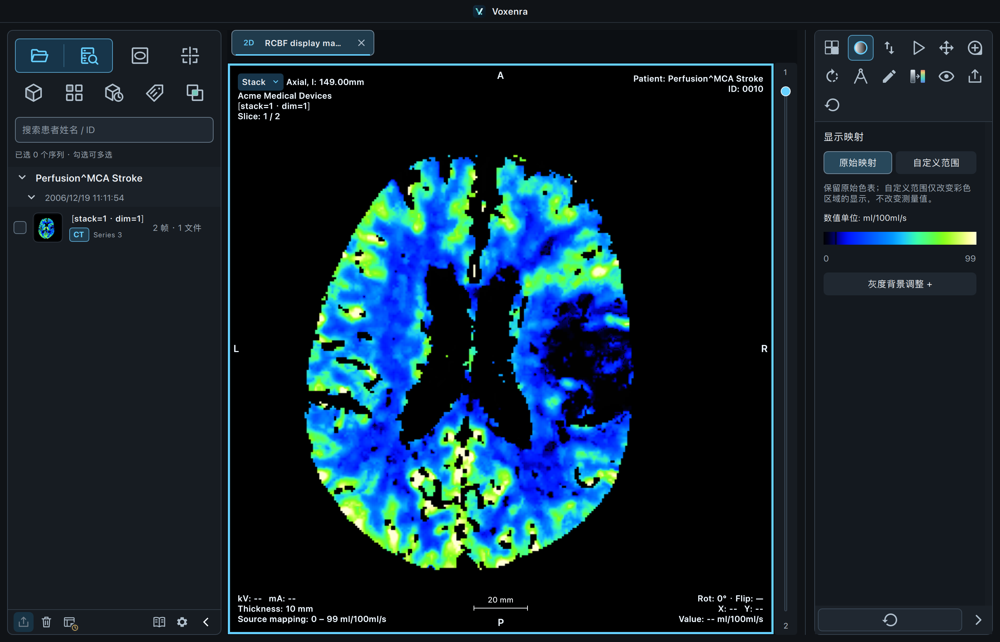
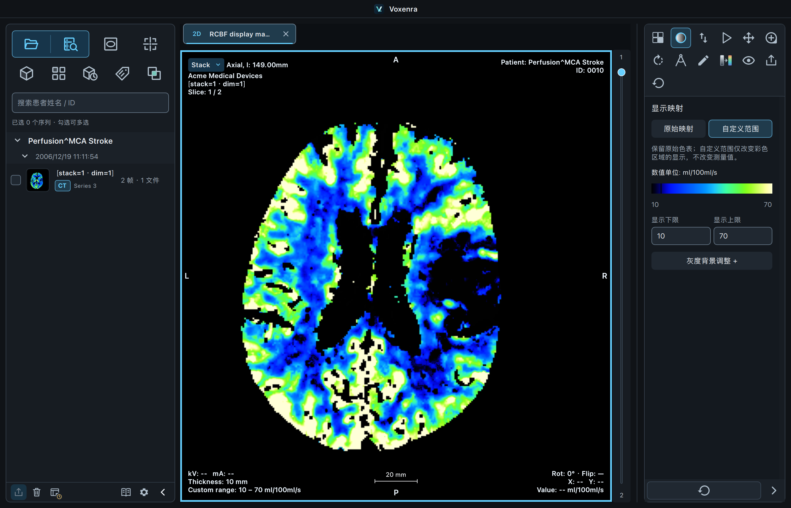
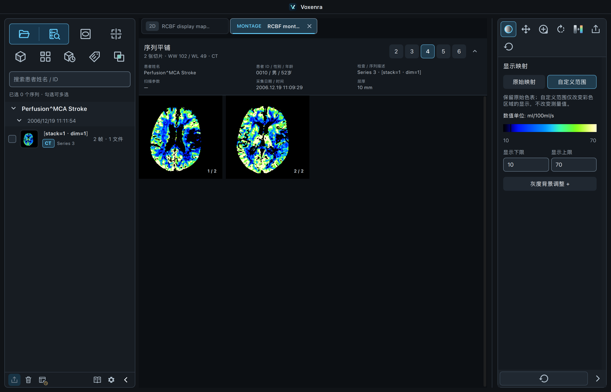

# 显示映射验收 · 2026-09-16

代码位于 `codex/enhanced-ct` worktree。使用文稿中现有影像库 `/Users/jun/Documents/test_dicom`，测试读取原始 DICOM；演示截图来自公开 NEMA RCBF 样本。

## 最终回归

完整 `pytest tests -q`：**1777 通过、60 跳过**，耗时 341.59 秒。跳过项由原生环境、外部数据或平台条件控制；外部影像和原生 VTK 在下方另外执行。597 个警告来自已有第三方依赖和测试边界样本。见 [完整运行日志](full-tests.txt)。

## 原生影像验收

最终代码上 **25 项通过**，耗时 34.65 秒。涵盖 UI、原生 VTK 视图、数值、单位、患者坐标与导出；其中包含 2 个合成 MR 填充值边界用例。有 16 个第三方库警告，验收场景没有 QML 警告。见 [运行日志](native-tests.txt)。

| 影像 | 验证的视图／操作 |
| --- | --- |
| Enhanced CT 心脏 CT，54 帧 | 逐帧数值与坐标、2D、MPR 三平面／四宫格、原生 3D、PNG 与源 DICOM 导出 |
| Enhanced CT 灌注 RCBF，2 帧 | 原始／自定义色彩范围、单位、翻帧、灰度背景保留、平铺、源色恢复及 PNG 导出 |
| 普通 MR，两种体位 | 2D 调窗和反白、光标／ROI、患者坐标、MPR 布局、对比、工作区恢复与导出 |
| Enhanced MR、多时相／回波样本 | 帧值与参考数据、几何、四序列对比、视口尺寸切换 |
| 1 mm 薄层 MR | 原生 3D 模板、MPR 及三维参考、裁剪和恢复 |
| 文稿 PET/CT 配对数据 | CT/PET 2D、CT MPR、PET MPR/MIP、PET/CT 融合、PET 3D、融合 3D；PET 单位转换同步缩放范围 |
| 文稿 P113 多时相 CT | 4D 及切换时相后保留联动窗口 |

这组验收验证当前支持的视图，并不表示灌注图可做 HU 体重建，或动态 PET／MR 4D 已获得支持。

## 数值与状态检查

新增自动化用例检查：

- 自定义色彩范围依据数值域映射，保持灰度背景与测量数组。
- 源模式恢复原始颜色；不同单位的自定义范围不会错用到新帧。
- 即时预览与后台渲染一致；平铺缓存和重置保持正确。
- 工作区范围状态可序列化／恢复，非法上下限拒绝提交。
- CT／MR、PET、补充彩色、3D 采用不同的显示能力；PET 3D 和二维面板切换没有布局循环。

## 界面

原始映射，源色表范围 0–99 ml/100ml/s：

自定义 10–70 ml/100ml/s，灰度背景和测量值保持不变：

两帧平铺使用同样的范围：

使用和复现说明见 [显示映射](../../display-mapping.md)。
