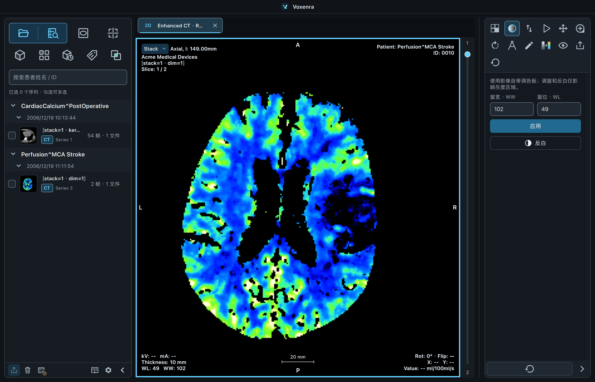
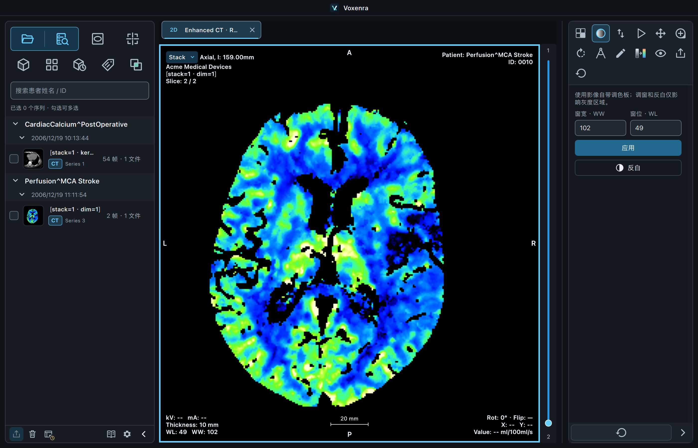
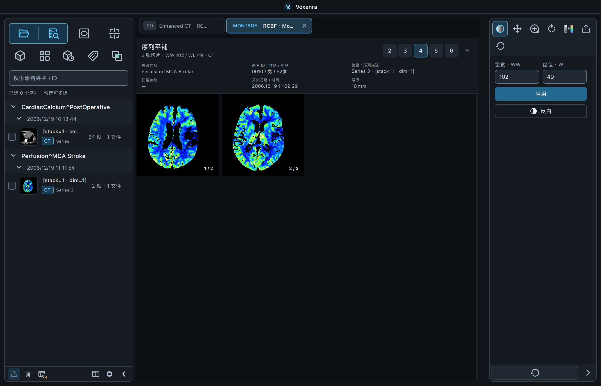
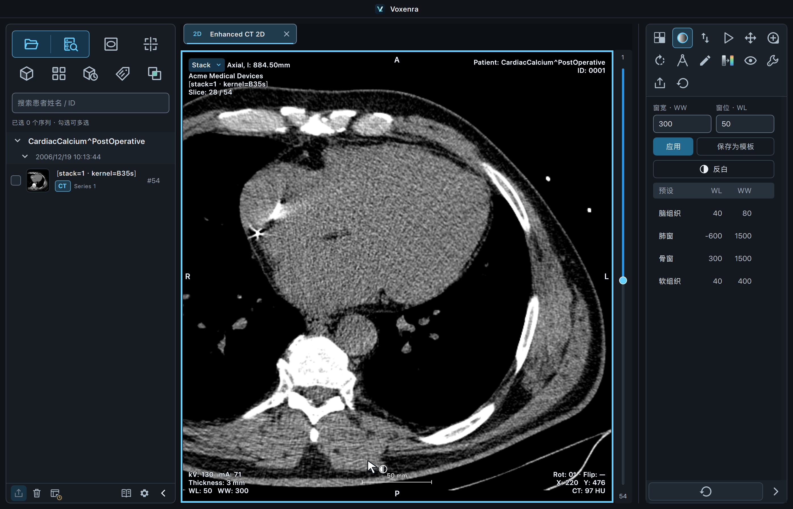
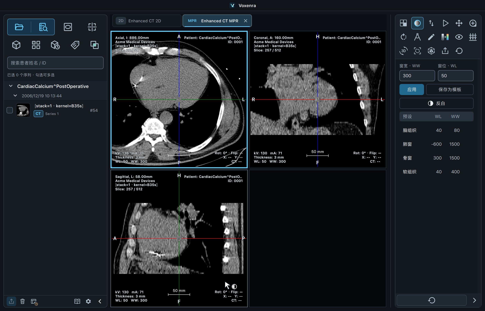
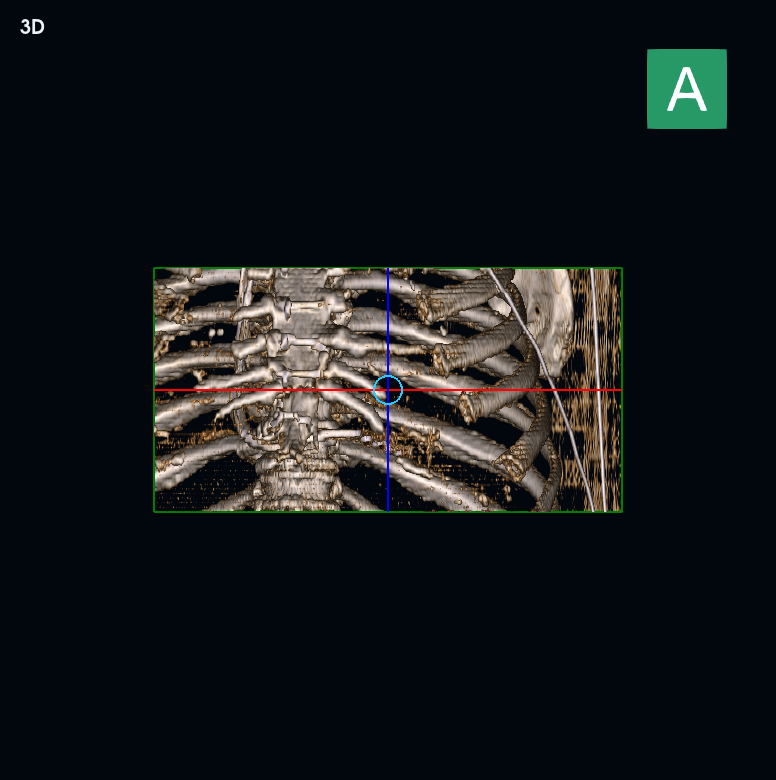
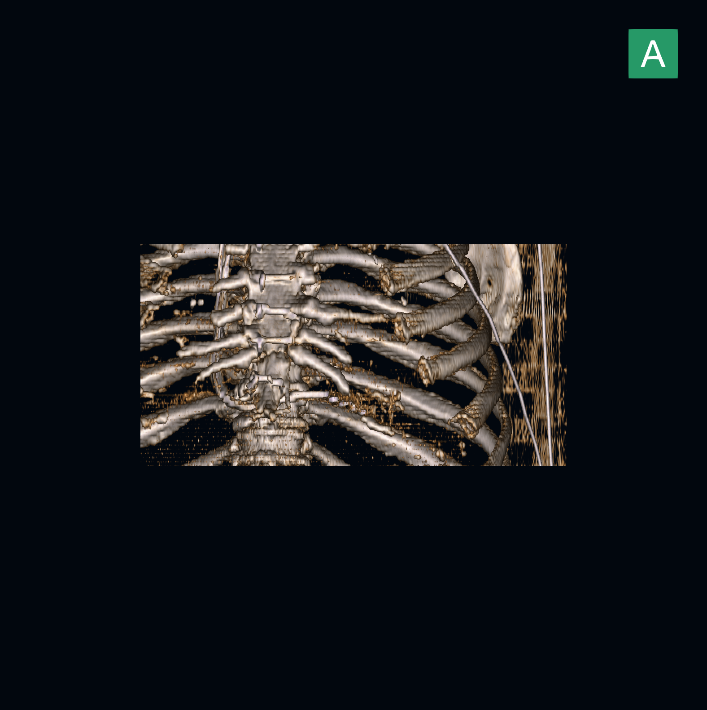

# Enhanced CT 首轮验证 · 2026-09-16

环境：macOS、Python 3.13、仓库既有 `.venv`；实现基于 `main` 的 `8baa018`。样本来源与边界见 [测试数据说明](../../enhanced-ct-test-data.md)。

## 灌注查看增量验收

本节为补充彩色实现后的最终结果；下方首轮记录描述之前的 HU 实现。

- 相关回归：**191 通过**，涵盖 CT/MR、窗口、平铺、对比、工具、侧栏与 QML。
- 原始公开样本原生验收：**4 通过**（macOS cocoa）；54 帧 HU 逐像素和几何、MPR/3D、2 帧 RCBF 颜色与物理数值、反白保持颜色、2 张彩色 PNG 导出、平铺。最终样本场景没有 QML 警告；2 个第三方弃用警告。
- RCBF RGB 结果逐像素对照源 LUT；物理数值直接对照源 RWVM。合成测试另用不同的 Rescale 和 RWVM 斜率验证显示域与测量域分离。未做独立厂商软件的像素对照。
- 样本与原始 DICOM 保持不变；没有额外下载或生成灌注数据。

## 首轮 HU 检查结果

- 全量 `pytest tests -q`：1730 通过、53 跳过；27 个用例启动本地 PACS HTTP 服务时受沙箱端口权限限制。
- 在允许本地端口的环境中补跑 `test_pacs.py`、`test_pacs_qml.py`、`test_workspace_interactions.py`：54 通过，覆盖上述全部 27 个受限用例。合计全量用例 1757 通过、53 跳过。
- Enhanced CT 合成专项：22 通过。包含标准／Legacy Converted、RLE、共享／逐帧几何、每帧 HU 与窗值、时相与未知维度隔离、重复位置保护、多对象增量合并、PNG／DICOM／匿名导出、2D／MPR／3D 和工作区恢复。
- 公开样本验收（macOS `cocoa`、原生 VTK）：3 通过。完整核对 CT0001 的 54 帧、共 14,155,776 个像素与患者坐标，验证非 HU 样本拒绝策略；本地导入、翻页、2D／MPR／3D、54 张 PNG 导出和原始 DICOM 字节一致。
- 最后增补彩色呈现保护并整理扫描代码后，Enhanced CT / MR、语言与手册相关回归74 项再次通过（[日志](focused-tests.txt)）。
- 仅出现既有 VTK/NumPy 弃用警告等库警告；原生样本场景没有 QML 警告。

逐像素参考直接使用 pydicom 解码的原始存储值与源功能组读取，几何参考直接从源 IPP/IOP/PixelSpacing 计算，不复用应用的帧元数据提取器。该检查不是独立厂商解码器对照。MPR 另检查中心点的三线性插值值。

## 图像证据

QML 的 `grabWindow()` 不包含原生 VTK 子窗口，四宫格截图右下因此为空；实际 3D 参考图由原生 VTK 单独导出并核验：

[逐组结果](validation-enhanced-ct.json)。原始样本和校验文件保存在 `/Users/jun/Documents/test_dicom/Voxenra-EnhancedCT-TestData`；原始影像与导出 DICOM 不纳入仓库。
