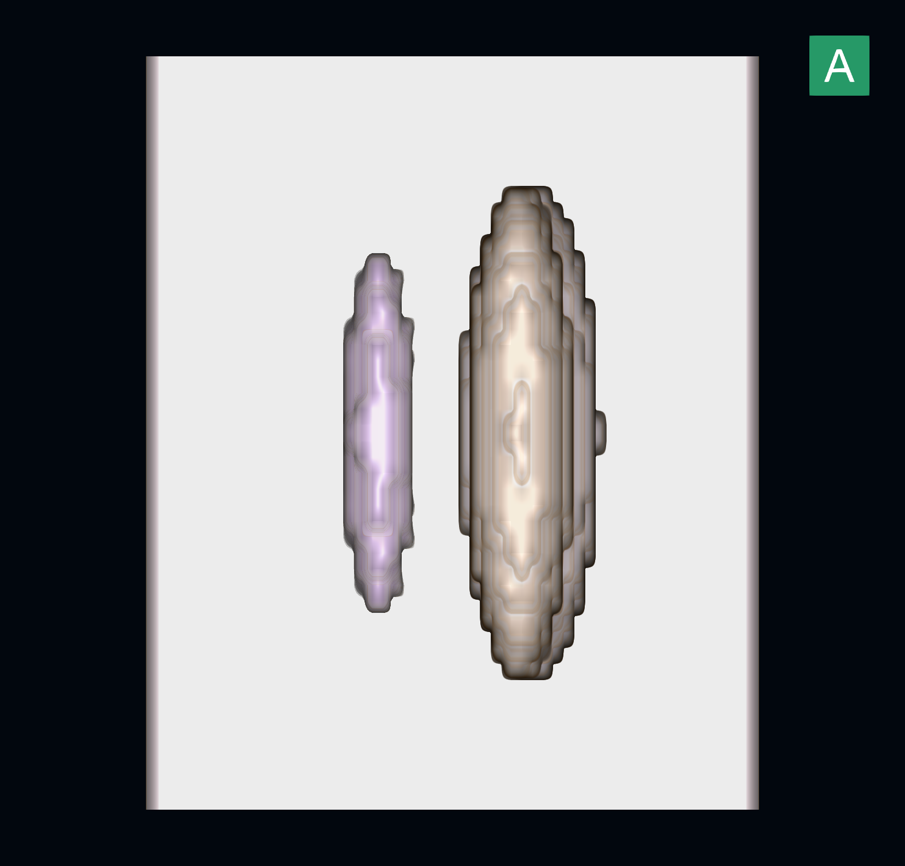
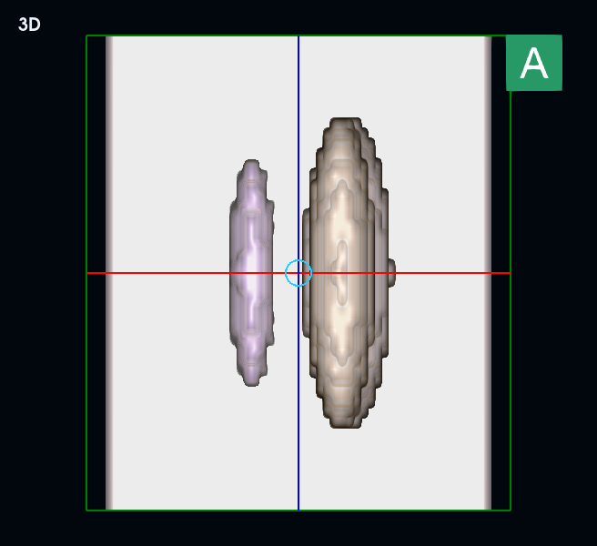

# MPR 布局入口与 3D 初始取景

## 修改

- 收起右侧工具栏时，布局入口由工具目录决定是否可用，不再要求当前激活视口为 3D。MPR 的轴位、冠状位、矢状位与 3D 均能打开布局面板。展开/收起侧栏保留已选中的布局工具。
- 独立 3D 与四宫格共享相机算法。渲染器使用正交投影，画面大小由 `ParallelScale` 决定，仅改变相机距离不能改变显示大小。
- 原先用体数据包围球适配窗口，体数据深度和对角线产生较多留白。现在将具有真实方向、间距的体数据边界投影到初始前视方向，按视口宽高比适配，限制边占视口约 87%。相机距离与裁剪范围仍覆盖整个体数据。
- 初始取景基准不随旋转变化，避免转动物体时自动变大变小。保留手动缩放和平移；用户旋转或放大后可能需要手动缩小以查看全貌。适配使用完整体数据边界，不依赖模板透明度或分割内容。

## 验证

- 离屏回归：106 项通过，3 项跳过（原生 VTK 测试 2 项及不适用的 PET 窗宽用例 1 项）。覆盖相机、裁剪投影、MPR 中心拖动、布局、CT/MR/PT 紧凑工具栏及 PET 融合。
- 原生桌面：布局相关 6 项通过；开启 `VOXENRA_NATIVE_QA=1` 后，CT/PT 四宫格原生交互 2 项通过。
- 几何测试：横长/纵长/常规体数据、正交/斜位方向、横屏/竖屏/四宫格视口，共 18 种组合；独立投影八个角点验证完整入框、余量和裁剪范围，同时确认旋转不隐式缩放。
- 合成 DICOM 原生 VTK 截图检查：独立 3D、默认窗口四宫格、1280×720 最小窗口四宫格。实际 VTK 投影测得限制边占比均为 0.870，无 QML 警告。截图不含患者数据。
- 本次未重新做 Slicer 交叉验证；本次验证范围为布局入口和相机取景。

重现截图及实际 VTK 投影检查：

```sh
QT_QPA_PLATFORM=cocoa QT_QUICK_BACKEND=software .venv/bin/python \
  tests/manual/check_initial_3d_framing.py build/validation/initial-3d-framing-20260917
```

脚本隔离用户设置，使用 `tests/manual/smoke_3d.py` 的合成体模。

### 独立 3D



### 最小窗口下四宫格的 3D 视口


