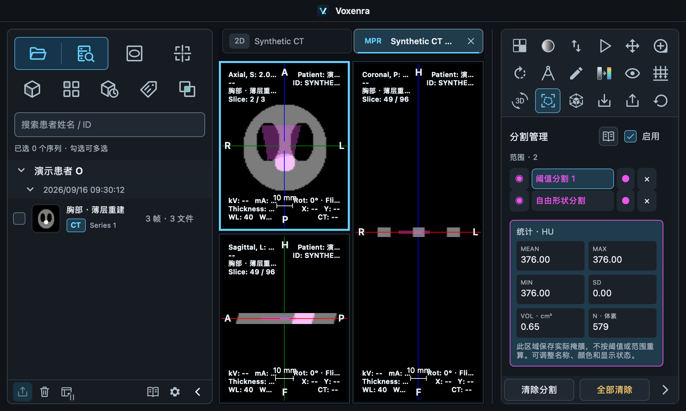

# main 整合、方案审查与 Slicer 交叉验证

日期：2026-09-16。所有操作针对本仓库；真实影像、掩膜、患者关联 DICOM、UID 与原生影像截图保留在 Git 忽略的 `build/validation/main-integration/`。本页附件仅包含汇总数据和合成影像界面。

## 整合范围

| 分支 / worktree | 整合内容 | 保存后的分支提交 |
| --- | --- | --- |
| `codex/compressed-dicom` | 固定像素解码组件、打包检查、公开样本与原生导入验收、能力限制提示；包含原先未提交的修改 | `7e17d1c` |
| `codex/enhanced-ct` | Enhanced CT / Legacy Converted 帧解析与分组、HU 重建、RCBF 补充彩色、显示范围与物理单位；原先未提交的全部成果先保存为提交 | `0ce39d9` |
| `codex/segmentation-export-report` | 自由形状测量、SEG/SR 导出、附属 SEG 导入与管理、完整 Slicer 往返脚本 | `ee6dc7a` |
| 原 main | 3D 预设与调窗、4D、播放、MPR 布局及已有修改 | `8baa018` |

三个工作分支均以 merge commit 合入 main，保留来源历史；原 worktree 和分支保留。冲突解决同时保留 Enhanced CT/MR 帧解析、统一压缩解码、MR 分割管理、显示映射及测量来源保护。依赖锁经 `uv lock --offline` 和 `uv sync --offline --group dev` 校验。

## 方案与 UI 审查

| 项目 | 判断及处理 |
| --- | --- |
| 左右导入入口 | 保留左侧原始 DICOM 导入、右侧当前影像附属 SEG 导入。右侧明确要求对应 MPR/4D 与时相，并直接提供分割管理入口。没有加入未实现的配准或 SR 导入按钮。 |
| 解码策略 | 阅片、缩略图与 PNG 共用指定组件，避免运行环境不同导致支持范围变化。未支持的精度／彩色主阅片与解码失败分别提示，原 DICOM 不改写。 |
| Enhanced CT | 按真实功能组解析几何与逐帧变换，按非空间维度分组；不能把时间帧混为空间层。规则 HU 体才开放重建，RCBF 等派生数据不套用 HU 分析。 |
| 显示映射 | 灰度窗、PET 范围、源调色板、自定义彩色范围、3D 传递函数采用各自控制。颜色改变不修改测量数组、单位或患者坐标；RCBF 灰度背景单独调节。 |
| 分割导出 | **修正原方案**：同一源文件、帧组与空间网格的区域保存为多区域 BINARY SEG，保留重叠、名称、颜色、追踪标识与算法信息。避免“一份 SR 引用多个独立单区域 SEG”触发本机 Slicer 越界。 |
| 内存与不同来源 | 按 128 MiB 的展开掩膜缓冲预算分批；单个区域超过预算时沿用原单区域导出能力，不拼成更大的多区域对象。每批 SEG 对应自己的 SR，不混用不同源网格或时相。预算不是整个进程的峰值内存承诺。 |
| SR 内容 | 分割统计与长度／角度／ROI 分开生成报告，保留原精度、坐标及引用。Slicer 平面测量读取失败不再影响分割统计报告。外部列表中分别显示 `Voxenra segmentation measurements` 与 `Voxenra planar measurements`，SEG 也有明确系列名称。 |
| 实际兼容边界 | 导出面板增加明确说明：Slicer 可读分割统计；平面测量 SR 仍受限，可另用 PDF/CSV 查看。没有虚构 Finding 或解剖信息绕过插件异常。 |
| 打包资源 | **修复 ScalarMappingPanel.qml 缺少 QRC 注册**，否则源码界面能开而资源打包后可能缺失。检查 ScalarMappingPanel、ImportPanel 及语言 JSON。 |
| 手册一致性 | 清理“没有 SEG 导入导出”“Enhanced CT 不支持”等过时说明；同步中英文、内置手册和导出／工作区文档。 |
| 测量界面生命周期 | 全量回归发现切换／销毁视图时测量数据与 QObject 方法可能先失效。为长度、角度、ROI 和悬停清理增加空值保护；新增 4 项实际 QML 数据失效与恢复测试，相关界面专项 83 项通过。 |

原生小窗口 smoke 在 1000×600、右侧 260 宽度下实际完成自由形状转分割、SEG/SR 导出、双区域 SEG 重新导入和分割管理；面板可滚动操作，无 QML 警告。常规 1400×900 原生窗口另覆盖复杂影像流程。



## Slicer 实际验证

环境：**Slicer 5.12.4**，独立 GDCM 读图路径，内置 SEG/TID 1500 插件及 **dcmqi 1.5.4 / a102298**。使用独立 Slicer 进程和临时数据库；没有改动用户原 Slicer 场景、数据库或插件。参考软件也有能力边界，不能只以“看起来像 Slicer”判定数值正确。

### 1. 影像值与几何：15 组

- **Enhanced CT 54 帧、P113 CT、脑 MR**：在原始患者空间对齐后，完整体素一致、空间仿射一致；从 Slicer 独立加载并显示切面与体绘制。
- **12 个公开单帧样本**：覆盖 7 个压缩样本及 5 个未压缩对照。11 个的有效像素完全一致；其中 CT `693` 的压缩／未压缩副本均有 55772 个填充像素，本软件按 DICOM Padding 排除为 NaN，Slicer 保留为 −3024。排除填充区后，两者完全一致。
- **有损 JPEG 2000 `MR2_J2KI`**：1048576 个像素中，707 个相差 1 个存储灰度级（369 个 −1、338 个 +1，约 0.0674%）；按该文件 RescaleSlope 换算约 3.774114 来源单位。其余差别仅为 float32/float64 精度。本项目本机 `pylibjpeg` 与 `python-gdcm` 解码的存储值互相一致，Slicer 内置读图路径有上述差异。此例明确记录为**有损解码差异，不是逐像素完全一致**；没有修改原数据迁就参考显示。

机器结果：[15 组对照](slicer-images.json)。脚本 `tests/manual/integration_slicer_images.py` 保存实际比较结果；有损差异另列，不因程序退出成功就宣称全部完全一致。

### 2. RCBF 补充彩色图

同一公开样本的两帧、512×512 数值与 Slicer 完全一致。但本机 Slicer 的该读取路径显示 **Grey**，没有单位元数据；本软件按源 Supplemental Palette 与 RWVM 显示 RGB 和 **ml/100ml/s**。

因此不把本软件改为灰度或丢掉单位：源 LUT 和 RWVM 的逐像素专项已经通过；自定义显示范围及反白仍不改变统计值或源彩色部分。这里只证明该样本数值和源映射处理正确，不宣称已实现灌注计算或所有 RWVM 类型。

机器结果：[RCBF 对照](perfusion-comparison.json)。使用 `tests/manual/slicer_perfusion_probe.py` 实际加载并记录参考能力。

### 3. SEG 与分割统计 SR：完整 GUI 往返

实际执行：Slicer Segment Editor 复制基线、保留重叠、点击可用的 Margin Apply → Slicer 导出 → 本软件右侧按钮导入／管理／导出 → Slicer 插件读回。P113 使用可用的 5 mm Margin，MR 使用 3 mm；实际离散扩张依赖原始间距。

| 项目 | P113 CT | 脑 MR |
| --- | ---: | ---: |
| 基线体素数 | 111577 | 851022 |
| Slicer 编辑后体素数 | 528999 | 1276283 |
| 重叠体素数 | 111577 | 851022 |
| 本软件导入及 Slicer 返回掩膜 | 逐体素一致 | 逐体素一致 |
| 单区域分割统计 SR | 加载成功 | 加载成功 |
| **多区域分割统计 SR** | **加载成功，原兼容问题已修正** | **加载成功，原兼容问题已修正** |
| 独立平面测量 SR | Slicer 插件异常，未通过 | Slicer 插件异常，未通过 |

SR 表格核对体积、均值、标准差、极值、体素数、单位及追踪标识，相对数值容限 `1e-12`；dcmqi 另核对分割引用及平面 ROI 的面积／周长。数值一致指报告往返保真，不是用 Slicer 独立重算了全部统计指标。

机器结果：[P113](p113-roundtrip.json)、[MR](mr-roundtrip.json)。二者 `volume: true`、`single: true`、`planar: false`，因此仍是 `all_sr_gui_loaded: false`，没有把局部成功包装为全部 SR 兼容。

平面报告的实际失败仍为本机插件直接读取缺失的可选 `finding_type.CodeValue`。即使补齐该字段也不能据此认定自由轮廓空间显示正确，且本软件不能推测诊断。该能力保留标准 SR 输出并明确提示限制，未修改 Slicer。前次失败定位见[历史验证](../slicer-roundtrip-20260916/README.md)。

## 回归与边界

- 合并后首轮全量：**1853 passed、62 skipped**。
- 原生外部影像验收：**45 passed**，覆盖显示映射、Enhanced CT、MR、PET/CT、4D 与 20 个压缩样本导入；20 个公开文件中 12 个可阅片、8 个按已知限制处理，不能解释为全部影像格式均支持。
- 多区域 SEG、分离 SR、Enhanced CT 源帧引用新增专项，以及最终小窗口原生 smoke 已通过。
- 最终全量：**1860 passed、62 skipped、718 warnings**，355.56 秒。中间一轮出现视图生命周期 QML 异常，修复并新增 4 项失效／恢复测试后全量通过；保留原有警告检查，没有改成忽略异常。62 项跳过不计为通过，依赖库警告保留在日志中。
- 静态检查：Python 编译、Ruff 的 E9/F63/F7/F82、Git diff whitespace、QRC 及语言 JSON 校验。

本轮为 macOS 源码与原生窗口验收；未重新构建安装包，未运行 Windows GUI。Slicer 的颜色、阴影和采样设置可改变 3D 外观；本轮新增重点是合并后的像素／几何、原生工作流、SEG/SR 交换，原 3D 预设与调窗的详细视觉对照保留在 [3D 验证](../slicer-3d-comparison-20260916/README.md) 和 [多样本比较](../slicer-multicase-20260916/README.md)。

## 复现入口

从 main 根目录运行；外部样本仅使用本机已有文件。原生 GUI 阶段串行，避免窗口争抢焦点。

```sh
uv sync --locked --group dev
QT_QPA_PLATFORM=offscreen QT_QUICK_BACKEND=software .venv/bin/python -m pytest tests -q

INTEGRATION_ROOT="$PWD/build/validation/main-integration/images" \
  .venv/bin/python tests/manual/integration_slicer_images.py
INTEGRATION_STAGE=slicer INTEGRATION_ROOT="$PWD/build/validation/main-integration/images" \
  /Applications/Slicer.app/Contents/MacOS/Slicer --no-splash --ignore-slicerrc \
  --python-script "$PWD/tests/manual/integration_slicer_images.py"

PERFUSION_DICOM="$HOME/Documents/test_dicom/Voxenra-EnhancedCT-TestData/pydicom/eCT_Supplemental.dcm" \
INTEGRATION_ROOT="$PWD/build/validation/main-integration/perfusion" \
  /Applications/Slicer.app/Contents/MacOS/Slicer --no-splash --ignore-slicerrc \
  --python-script "$PWD/tests/manual/slicer_perfusion_probe.py"

QT_QPA_PLATFORM=cocoa QT_QUICK_BACKEND=software .venv/bin/python tests/manual/smoke_segmentation_export.py
```

15 组脚本使用 `VOXENRA_TEST_DICOM_DIR`（默认文稿 test_dicom）及保留 worktree 中前轮 CT/MR manifest 来定位相同源序列。SEG 往返按[脚本说明](../slicer-roundtrip-20260916/README.md#复现)依次运行 edit、Voxenra GUI、verify、数值检查；当前 exporter 生成独立的 `SR-001.dcm` 分割统计与 `SR-002.dcm` 平面测量。当前输出位于 `build/validation/main-integration/roundtrip/{p113,mr}`。
