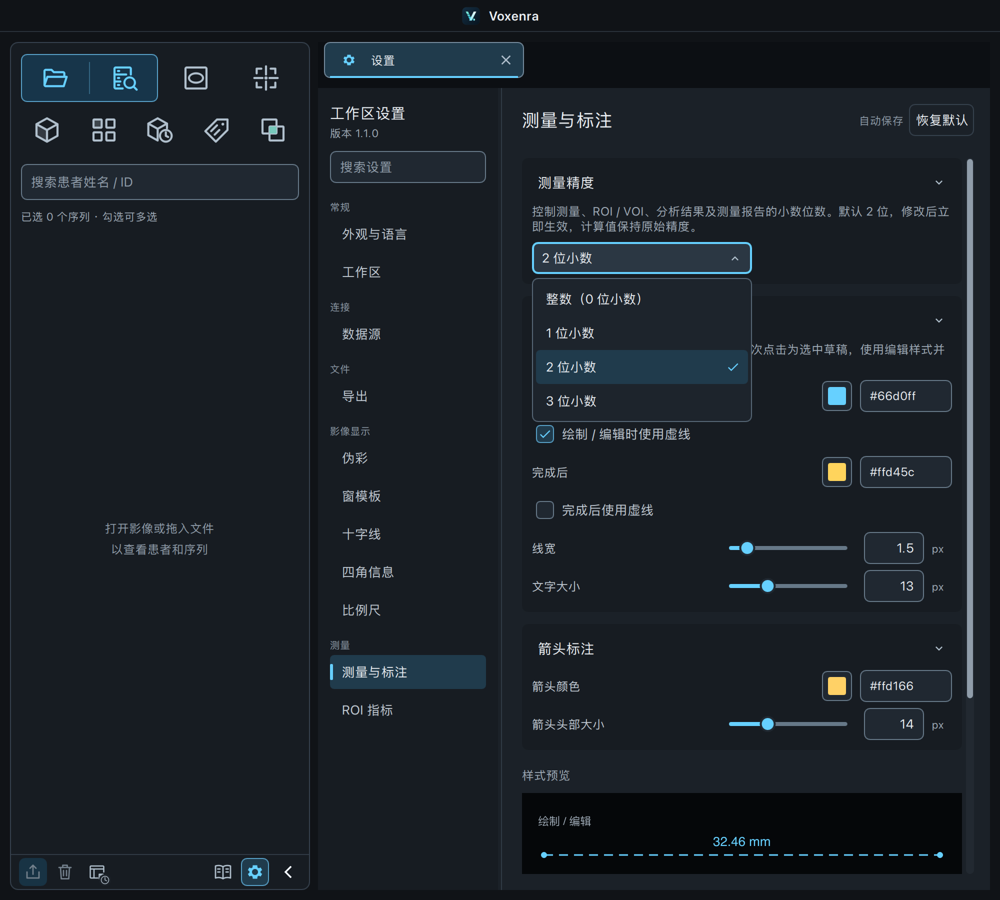
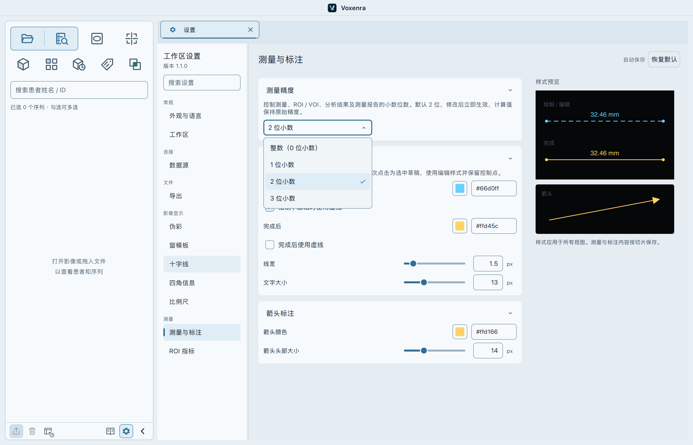
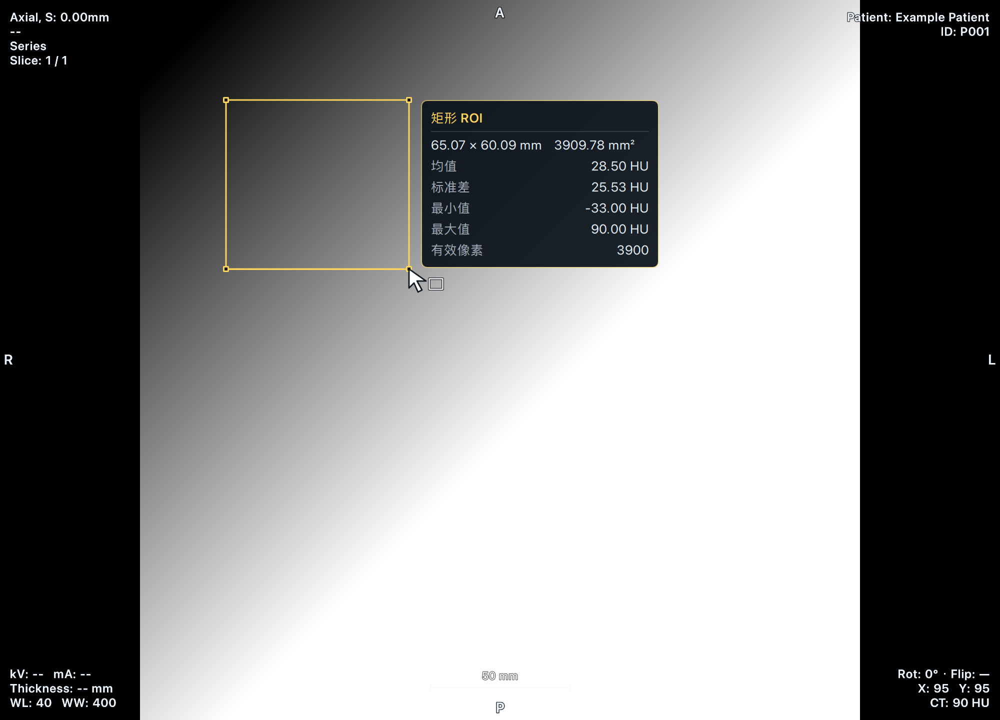

# 测量显示精度验证 · 2026-09-15

分支：`codex/sidebar-style-polish`。默认保留 2 位小数，可在“设置 → 测量与标注 → 测量精度”选择整数或 1–3 位小数；可搜索“精度”“小数位数”“整数”。这里的精度指显示小数位数，不是有效数字位数，也不改变成像或计算精度。

## 覆盖范围

- 长度、角度，矩形/椭圆 ROI 的尺寸、面积和强度统计，融合 ROI 的第二组强度统计，VOI/分割的体积及统计，共用固定小数格式；数量保持整数。
- MTF 结果、ROI 尺寸和水模 QA 的结果标签/列表采用同一设置；图表采样及分析输入保留原精度。只更新格式，不重新计算测量或分析任务。
- CSV/PDF 数值使用导出开始时的精度；后台导出期间修改设置不会使一个报告混用不同精度。缺失值、非有限值保持缺失标记，小负数舍入为零时去掉负号。
- 设置自动保存、重启继续使用。旧配置缺失此项时补用 2 位，非法精度回退默认值；本分类恢复默认时回到 2 位。
- 既有和正在绘制的测量立即刷新文本，原始测量值、控制点、选中对象、像素与工作区持久化结果保持不变。

## 验证结果

- 原生 macOS QML 界面：**88 passed**。覆盖设置页、已完成测量、整数/1/2/3 位切换、ROI、MTF、水模 QA、VOI 与现有样式行为。
- 基础/报告回归批次：143 项，首次 **138 passed / 5 failed**；5 个失败是新 PDF 测试枚举写法和旧默认报告精度预期，修正测试后相关 **20 项全部通过**。
- 中文搜索和深浅主题下拉交互最终复核：**2 passed**。中文输入使用输入法提交事件；初次使用仅支持 ASCII 的 Qt 键盘测试方法导致测试进程退出，已修正测试输入方式。
- MR/PET 相关回归：**65 passed**。
- 未重跑全量测试。原生分析测试伴随 11 条 VTK/NumPy 弃用提示，MR/PET 测试退出时有资源回收提示；没有未解决的测试失败。`git diff --check` 通过。

记录位于 `/tmp/voxenra-sidebar-polish/measurement-precision-native.xml`、`measurement-precision-regression.xml`、`measurement-precision-recheck.xml`、`measurement-precision-search.xml`、`measurement-modality-regression.xml`。

截图来自原生窗口及合成影像，未修改截图：

