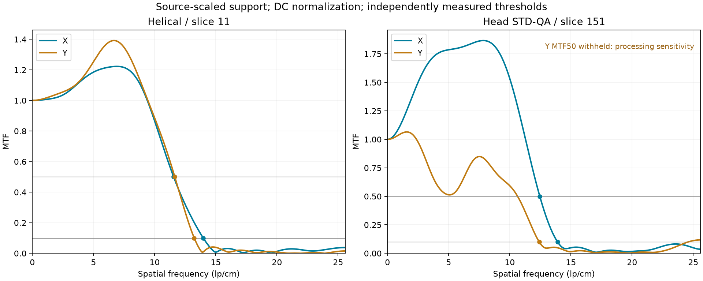

# MTF 最终实现：两组点源复核

## 结论

本轮替代此前随手绘 ROI 边界改变加权范围的默认实现。新样本显示旧方案确有问题：噪声随积分范围改变，Y MTF50 在不同 ROI 下会跨到不同的下降交点。仅添加警告无法解决交互时的跳值。

最终采用**以点源宽度确定有效积分范围、局部外环背景校正、实测频谱及逐指标敏感性检查**。MTF50 与 MTF10 独立求交；不从 MTF10、FWHM 或目标参考值换算 MTF50。不裁掉负值，不强制曲线单调，也不归一化到频谱最大值。独立 FWHM/层厚工具未改动。

这确定了产品的默认计算方法与失效处理，并非对扫描仪真实 MTF 的认证。尤其不能为了接近同事的 7～8 lp/cm 而压低结果。

## 影像与排序

| 样本 | 切片与请求坐标 | PixelSpacing | 重建核 |
|---|---|---|---|
| 螺旋 MTF | 第 11 张，X597/Y605 | 0.1953125 × 0.1953125 mm | H13 |
| 2026-09-17-01-19-24 | 第 151 张，X507/Y411 | 0.1953125 × 0.1953125 mm | H13 |

切片编号按本软件的空间位置排序，X/Y 按零基列/行坐标。新系列共 288 张，第 151 张对应 DICOM InstanceNumber 138、Z = −783.40656 mm；局部最亮点为 X508/Y412。选择中保留请求坐标，算法只在该 ROI 内定位主峰。

新样本用本地 Slicer 5.12.4 / GDCM 独立解码，完整 1024 × 1024 原始强度数组与本软件完全一致。旧样本与之前的 Slicer 导出数组一致。**Slicer 在此只核对像素与几何，并未提供官方 MTF 结果。**

## 最终计算约定

1. 使用原始强度与实际 PixelSpacing，调窗、缩放和显示旋转不参与计算。
2. 以 ROI 外边框的稳健背景平面作为初值，定位主峰；主峰所在行/列的半高宽只用于估计有效支持范围，不用于换算任何 MTF 指标。
3. 在主峰外 4～6 倍对应方向半高宽的矩形外环中拟合局部背景平面。外环采用连续余弦权重及 5 次 Huber 重加权；背景和支持宽度迭代收敛。矩形外环按各方向宽度归一化，兼容各向异性像素。
4. 保持距主峰 3 倍半高宽以内的响应，3～4 倍范围余弦衰减至零。两个方向权重相乘后形成二维加权 PSF，分别投影成 X/Y LSF。使用原始正负响应。
5. 必须在用户 ROI 内容纳完整背景外环；不足时显示建议尺寸及居中要求，不填充背景、不按 ROI 边界临时缩窄支持范围。本例建议居中使用 **55 × 55 px 或更大**，并避开其他目标。建议尺寸随目标宽度变化，不硬编码为本例尺寸。
6. 去除纯零外部填充，保留端点零样本；FFT 零填充至至少 1024 且至少有效 LSF 长度的 16 倍，取 2 次幂。频率以实际像素间距换算，上限为 Nyquist。归一化前要求直流积分为正。
7. MTF50/10 独立取同一曲线首次下降至 0.5/0.1 的插值交点。无交点保留“未达到”。频谱超过 1 和非单调响应照实显示。
8. 检查加权范围 ±10% 以及背景外环 4～5.5 倍宽度的变体。某一指标偏离基准超过 8% 或交点丢失时，仅将该指标标为不可靠，显示 **—**，原因收在信息按钮内。曲线及其他可报告指标保留。8% 是工程敏感性门限，不是置信区间或临床合格标准。

上述支持范围与门限是本软件的工程选择。参考资料支持投影 LSF、保留响应及尾部加权的原理，不等于对这些具体参数的背书。完整 ROI 扩大后选中相同点源时有效积分范围不变，是明确的自动支持选择；不是缓存旧结果或对多个 ROI 结果取平均。

## 结果

以下为 65 × 65 px、以请求坐标为中心，单位 lp/cm：

| 样本 | 方向 | MTF50 | MTF10 |
|---|---|---:|---:|
| 螺旋，第 11 张 | X | 11.5544 | 13.9746 |
| 螺旋，第 11 张 | Y | 11.6484 | 13.2374 |
| 新样本，第 151 张 | X | 12.4552 | 13.9060 |
| 新样本，第 151 张 | Y | — | 12.4093 |

旧默认方案在新样本居中 17/25/33/41/49/65 px ROI 下，Y MTF50 分别约为 9.91/3.28/10.92/9.62/11.73/5.12 lp/cm。其原因是背景与有效支持随边界改变，低频凹陷可跨过 0.5 水平。

最终方案的新样本 Y 方向基准曲线虽可产生约 10.64 lp/cm 的 MTF50，改变加权范围后会落到约 5.02 lp/cm，背景变体又可到约 11.18 lp/cm。这不是可稳定报告的单值，因此界面不显示 10.64。降低采集噪声、检查目标或使用同重建条件的更适合影像后应重新测量；单纯继续放大手绘 ROI 不会消除既有噪声。

## 交叉核对及其限制

实际运行 **ImageJ 1.54p 中 SPICE-CT 原版 MTF 字节码**，输入相同原始强度与像素间距，不调用本软件算法。请求 64 × 64 px ROI，插件按自己的规则重新定位点源：

| 样本 | SPICE-CT MTF50 | SPICE-CT MTF10 |
|---|---:|---:|
| 螺旋，第 11 张 | 8.7527 | 12.2298 |
| 新样本，第 151 张 | 9.2109 | 12.1772 |

SPICE-CT 对径向 PSF 插值并作一维变换，内置固定微珠尺寸修正。本软件对二维 PSF 作 X/Y 投影，未在目标尺寸未知时擅自作有限尺寸反卷积。二者方法、方向合并、背景和支持范围不同，**不能把这些差值当作本软件的误差百分比，也不能用 ImageJ 平台的知名度替插件算法作认证**。插件来自官方发布包；包下载不完整，但实际运行的 MTF 类与源码已按 ZIP 成员 CRC 和长度校验完整，字节码未修改。

此前 imageQC 原始点源数值函数在旧样本 33 × 33 ROI 的离散法结果为 X/Y MTF50 约 11.02/11.01；新样本的部分设置出现拟合失败，不能把缺失方向作为有效参考。按用户偏好，它仅作为补充材料，不作为最终选择算法的依据。当前仍没有同方法、同参数的认证真值或同事软件的实现说明。

## 验证与复核入口

相关回归共 **175 项通过**，覆盖数值计算、后台控制器、真实 QML 交互、独立 FWHM、服务面板与语言资源。剩余警告来自 VTK/NumPy 及 SWIG 的既有弃用提示。

- 两组样本各检查 150 个完整 ROI：边长 55/57/59/61/63/65 px，X/Y 各移动 −2～+2 px。所有可报告指标的全范围变化小于 0.001%；新样本 Y MTF50 在全部变体中均被一致标记。该数值表示同一幅图的 ROI 交互稳定性，**不是扫描仪测量误差**。
- 原始频谱另用显式复指数求和核对，最大绝对差 < 5 × 10⁻¹⁵；阈值用二分求根核对，插值相对差 < 0.002%。这是独立数值实现核对，不是第三方临床验证。
- 解析高斯/锐化高斯覆盖负旁瓣、超调和各向异性。有限支持加权相对无限解析响应的曲线绝对偏差 < 10⁻⁵，阈值相对误差 < 10⁻⁴。
- 包含两组去除所有 DICOM 头信息的局部像素回归夹具，覆盖 ROI 稳定性、独立指标失效、单像素无交点、非正直流积分以及单位换算。
- 界面端到端检查：不可靠值为“—”，无交点为“未达到”，其他指标可见，原因仅在信息弹窗显示；MTF 与 FWHM 状态独立。

数值复核：`.venv/bin/python tests/manual/validate_mtf_phantoms.py --output build/mtf-final`。
汇总：[summary.json](mtf-final-20260920/summary.json)。原始 DICOM 不进入仓库。

参考：

- [Phantom Laboratory / Smári 点源 MTF 原理](https://help-smari.phantomlab.com/hc/en-us/articles/4409239650835-Modulation-Transfer-Function-MTF)
- [ImageJ 官方 SPICE-CT 发布页](https://imagej.net/ij/plugins/spice-ct/)
- [imageQC 点源投影与尾部处理说明](https://github.com/EllenWasbo/imageQCpy/wiki/Appendix-C-_-MTF-calculations)

此前阶段性记录 `mtf-spectrum-20260920.md` 保留作为历史；最终默认算法和数值以本文为准。
