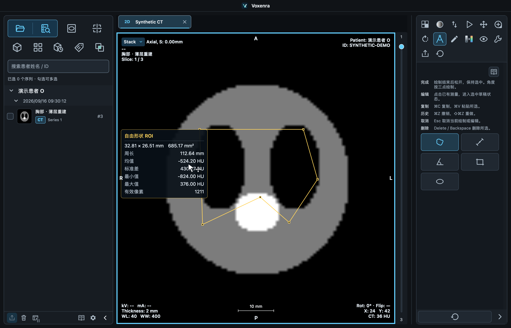
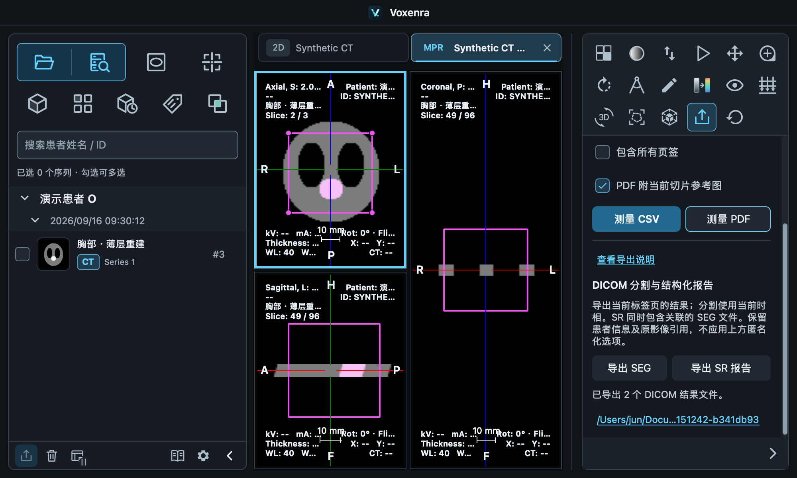

# 分割 SEG、结构化测量报告与自由形状 ROI

## 实现范围

基于 `main` 的 `8baa018` 创建分支 `codex/segmentation-export-report`，独立 worktree 位于
`.worktrees/segmentation-export-report`。本次没有合并到 main。

- **自由形状 ROI**：在「测量」工具中选自由形状，按住左键沿轮廓绘制，松开自动闭合。
  支持凹多边形、顶点编辑、整体移动、复制粘贴、删除、撤销重做与工作区保存恢复。
  显示面积、周长、包围盒宽高、有效像素数、均值、总体标准差、最小值与最大值。
- **导出 SEG**：在「导出 → DICOM 分割与结构化报告」中导出当前页签、当前时相的已完成分割。
  每个分割生成独立的二值 DICOM Segmentation Storage 文件，保留重叠分割。
- **导出 SR 报告**：导出当前页签已完成的长度、角度、矩形、椭圆和自由形状测量；
  同时导出当前时相分割／VOI 的 SEG 和对应的体积、体素统计、有效阈值。
  每个检查生成一份 DICOM Comprehensive 3D SR（TID 1500），包含 TID 1410／1411 测量组。
- **CSV／PDF**：自由形状与周长纳入现有导出。CSV 周长列追加到最后，保留原有列序；
  PDF 参考图包含自由形状轮廓。修复原有 VOI 报告读取 `seriesUID` 而实际记录为 `series` 的问题。
- **界面**：中文和英文说明、工具图标和光标均已接入；1000×600 窗口可滚动访问新导出按钮。

自由形状的几何面积和周长使用真实行列间距，支持各向异性像素。统计只采集轮廓内的有效
像素中心，包括边界中心，排除 NaN／padding。轮廓可超出影像，面积仍是完整轮廓面积，
统计只来自影像覆盖区域。自相交、退化或没有有效物理间距的轮廓不提交。

## DICOM 的来源与坐标

导出由 highdicom 0.28.1 构建，在后台线程写入新的结果目录；先捕获已完成测量和掩膜副本。
导出中继续修改、关闭页签不会改变已捕获的内容。失败或取消会清理暂存目录；成功才发布整个目录。
原始 DICOM 文件不作修改。

- SEG 使用原始体素网格，按患者 LPS 坐标关联每个有效切片。核对尺寸、间距、原点、方向、
  Frame of Reference UID、源 SOP UID，拒绝缺失或不一致的空间信息。
- Enhanced 多帧影像引用精确的 `ReferencedFrameNumber`，不把同一位置的其他时相／回波混入分割。
- 二维原图测量使用 SCOORD。程序中的整数像素中心坐标转换为 DICOM 像素角点坐标时加 **0.5**；
  第一像素中心为 `(0.5, 0.5)`。同平面不能唯一定位到一个源帧时拒绝导出。
- 普通 MPR 的重建平面使用患者 LPS 的 SCOORD3D，不伪造原始切片引用。
- 面积、长度、周长、角度、体积使用标准概念和 UCUM 单位。HU、SUVbw、Bq/ml、kBq/ml 等
  保留数值与实际单位；未识别的源单位使用明确的本软件代码，不假定为 HU 或 SUV。
- 通用区域、均值、SD、计数、阈值等补充概念使用 `99VOXENRA` 代码，名称可读。
  区域未标注为任何解剖或病变类别。UUID 派生 Tracking UID 稳定；体积组引用同次导出的 SEG。
- 报告状态为 COMPLETE、PRELIMINARY、UNVERIFIED，不包含人员签名或核验声明。
- 单 segment 的标识宏放到每帧 Functional Groups，以兼容本机 Slicer/dcmqi 的读取路径。

## 当前限制

- 导出当前页签；SEG／VOI 使用当前时相。CSV／PDF 的「包含所有页签」不作用于 SEG/SR。
- **SEG/SR 保留患者信息和原始影像引用**，上方匿名选项仅作用于既有导出。
  若要匿名交换，需要同时对源影像和结果做一致的 UID／身份重映射，本次未提供该流程。
- 尚在绘制／计算的区域、空分割、缺失来源、不同检查混在一个结果中、同检查身份不一致会报错。
- 投影和非原始网格的分割、配准后的 PET／融合测量不导出为普通切面结果。
  新建投影测量保存投影来源，即使关闭投影再导出，也会拒绝错误的普通切面引用。
  旧版工作区未记录投影来源，不能据此追溯旧测量；需要在普通切面重新测量。
- SR 包含数值测量，不包含箭头和自由文本标注。没有新增 SEG/SR 导入、PACS 发送或报告签名功能。
- 本次没有扩大现有 MR 分割工具的开放范围；下面的 MR 样本验证的是导出核心及格式互操作。
- 通过本机读回不代表已通过所有第三方工作站或完整 IOD 合规认证。

## 自动化验证

- 完整回归：**1755 passed，54 skipped**，耗时 344.27 秒。跳过项遵循现有条件。
- 最后补充投影来源与 PET 单位后，相关回归：**192 passed**，包括测量、MPR、PET 融合、工作区、
  真实导出按钮、SEG/SR、多帧引用和投影开关链路。这些用例与全量结果有重叠，不相加。
- 最后修正自由形状首个位移采样和光标映射后，再次执行相关测量／鼠标／导出／光标测试：
  **222 passed，1 skipped**，包括首个轮廓采样点未丢失和光标语义检查。
- 最终导出、控制器及自由形状专门用例：**29 passed**，包含仅导出 SEG 时对矛盾患者／检查信息的拒绝。
- 新增测试覆盖：斜轴和各向异性 CT、稀疏切片、重叠区域、源文件逐字节未改、Enhanced MR 的
  时相／回波帧关联、SCOORD/SCOORD3D、SEG 引用、Tracking UID、数值和单位、取消／错误清理、
  后台快照、自由形状凹区域统计、编辑／粘贴、工作区恢复与 CSV 周长。
- 原生 macOS Qt smoke：合成 CT 上实际指针绘制自由形状；实际按钮导出二维 SR 以及 MPR 分割的
  SEG+SR；检查 1000×600 导出布局。QML 无警告，结果写入成功。
- 新增 Python 文件通过 Ruff 的未定义名称／语法／未使用导入检查；`git diff --check` 通过。

## 本机 Slicer / dcmqi 读回

参考环境：3D Slicer **5.12.4**，内置 dcmqi **1.5.4 / a102298**。
使用本软件读取本地原始影像并生成验证用区域；这些区域仅用于测试，不是病变或诊断结果。

| 样本 | 分割体素数 | 体积 cm³ | 自由形状面积 mm² | 周长 mm |
| --- | ---: | ---: | ---: | ---: |
| P113 CT，MP1/ph0 | 111577 | 319.248868832428 | 14938.6469565253 | 574.743299651814 |
| Thin-3D-T1，脑 MR，192 层 | 851022 | 851.022000000049 | 3915.776 | 294.257272557444 |

两组 SEG 均由 dcmqi `segimage2itkimage` 解码成 NRRD，再按 NRRD 的 LPS 方向、间距和原点
映射回本软件的原始体素网格：**所有分割位置完全一致，无额外、遗漏或重复体素**。
两组 SR 均由独立的 `tid1500reader` 读出两个测量组，面积、周长、体积保持精度，SEG 引用正确。

P113 另外在独立 Slicer 进程中通过 `DICOMSegmentationPlugin` 实际加载：一个 segment，
111577 个体素，成功。使用临时 DICOM 数据库，没有清空用户已有的场景或数据库。
MR 没有另做 Slicer GUI 插件加载，只完成上述独立 dcmqi 解码与逐体素比对。

dcmqi 的 SR 校验日志提示其 VR checker 不支持 `ISO_IR 192`，但读取成功；导出使用 UTF-8。
验证结果和患者关联文件仅在忽略的 `build/validation/seg-sr/` 中，未加入 Git。

## 截图（合成数据）





## 复现

```sh
uv sync --group dev
QT_QPA_PLATFORM=offscreen QT_QUICK_BACKEND=software uv run pytest -q
QT_QPA_PLATFORM=cocoa QT_QUICK_BACKEND=software uv run python tests/manual/smoke_segmentation_export.py

uv run python tests/manual/validate_dicom_results.py /path/to/one/series /path/to/local/output
uv run python tests/manual/check_dcmqi_results.py /path/to/local/output /path/to/dcmqi/bin
RESULTS_ROOT=/path/to/local/output /Applications/Slicer.app/Contents/MacOS/Slicer \
  --no-splash --ignore-slicerrc --python-script "$PWD/tests/manual/load_results_in_slicer.py"
```

`check_dcmqi_results.py` 检查完整掩膜、数值和引用；Slicer 脚本另外验证实际插件加载。
验证源目录应只包含一个序列；若包含多个，导出脚本会选择实例数最多的一组。
手工 UI 脚本不依赖患者影像，生成合成 CT 和截图到 `build/validation/seg-sr/ui/`。

## 依据

- [DICOM TID 1500 Measurement Report](https://dicom.nema.org/medical/dicom/current/output/chtml/part16/chapter_A.html#sect_TID_1500)
- [DICOM SCOORD 像素坐标澄清 CP 2214](https://dicom.nema.org/Dicom/News/September2022/docs/cpack118/cp2214.pdf)
- [highdicom SEG](https://highdicom.readthedocs.io/en/latest/seg.html)
- [highdicom TID 1500 SR](https://highdicom.readthedocs.io/en/latest/tid1500.html)
