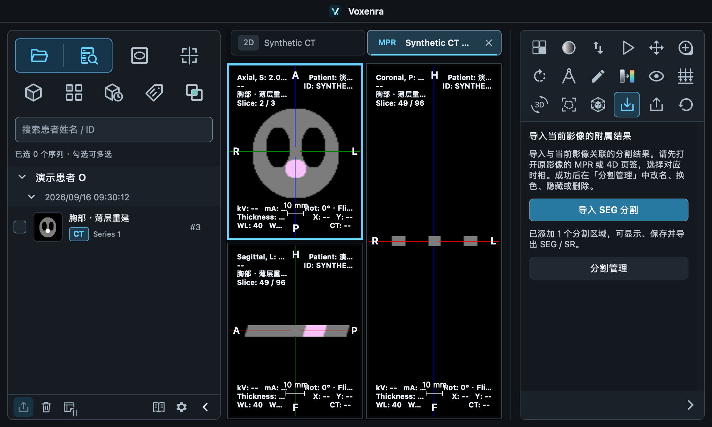
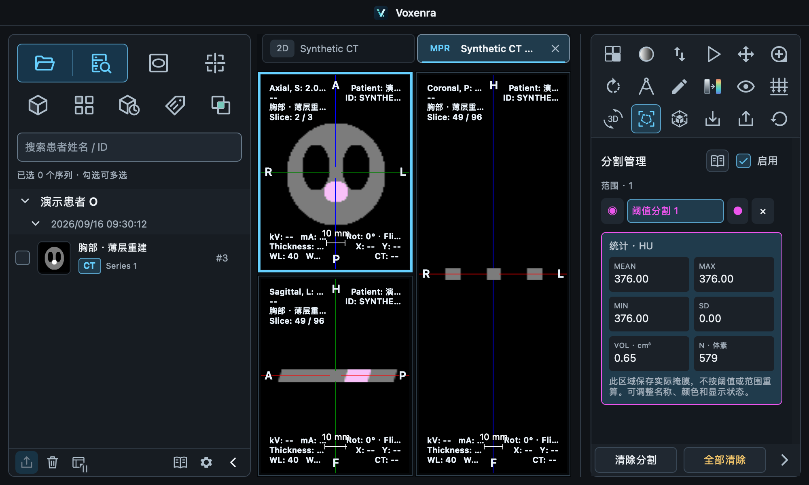

# SEG 导入与自由形状转换验证

日期：2026-09-16。沿用从 `main` 创建的 `codex/segmentation-export-report` 独立 worktree；本轮基于已有 SEG / SR 导出的 `f3b0c85`，没有合并到 main。

后续已补齐 [Slicer 实际编辑、双向 SEG 往返及 SR 插件加载验证](../slicer-roundtrip-20260916/README.md)：CT/MR SEG 均通过，单区域 SR 通过，多 SEG 引用及自由形状混合 SR 存在插件兼容限制。

## 本轮交付

- **右侧独立「导入」按钮**：用于当前影像的附属结果，本轮仅列出已实现的 SEG。左侧保留 DICOM 原影像导入；右侧不包含影像导入，导出面板不包含导入操作。
- **二值 SEG 导入**：按患者空间和源影像引用映射回原始网格，保留多个及重叠区域、名称、颜色、组织编码、算法说明和追踪标识。
- **分割管理**：三切面叠加、区域选择、改名、颜色、显隐、删除、撤销重做、工作区保存恢复及再次导出。MR 可管理固定掩膜，不开放 CT/PET 阈值绘制。
- **自由形状 ROI 转分割**：MPR / 4D 中选中的已完成 ROI 转换为最近的单个原始体素层，保留原测量，掩膜可保存与导出。

导入区域保存实际裁剪掩膜及原始仿射矩阵，不按阈值重新生成。工作区恢复不依赖原 SEG 文件；保存前校验容量限制。修改原 ROI 不会修改已经转换的掩膜。

## 自动化覆盖

最终全量回归：**1788 passed、54 skipped**，约 5 分 45 秒。右侧入口调整专项：83 passed；图标修正后原生 macOS smoke 再次通过，新增 QML / SVG 的资源注册检查通过。既有条件跳过项保留。

`tests/test_segmentation_import.py`：

- 外部 highdicom 生成的多区域、重叠、稀疏帧二值 SEG，逐体素往返一致。
- 裁剪与翻转的原始网格、非整字节大小的二值帧、中文名称及颜色、组织编码及追踪标识保持。
- 错误患者、检查、参考坐标系、重复空间帧、非原网格、取消与不支持类型的拒绝。
- 增强 MR 不同时间/回波逻辑组之间不能串用源帧；源文件 UID 与逻辑分组 UID 分别处理。
- ROI 三个原始体素轴、翻转及不同显示间距的中心采样；斜切和投影来源拒绝。

`tests/test_segmentation_exchange.py`：

- 真实控制器异步导入、三个切面叠加、撤销重做、改名换色和重复导入的原子拒绝。
- 删除 SEG 原文件后，从工作区恢复全部掩膜及显示状态，并输出两个 SEG 和关联 SR。
- 导入过程中取消、关闭目标标签页或切换时相，不写入过期结果。
- ROI 转换保留原测量，并可单独撤销。
- 1000 × 600 原生 QML 布局中点击右侧「导入」按钮、文件选择、分割管理、显隐、颜色和删除；无 QML 警告。

MR 工具回归验证「分割管理」可进入，但阈值绘制交互仍不可用。新 SVG 图标已注册并加入 QRC；中英文界面及内置手册同步更新。

## 本机 CT / MR 与 dcmqi 交换

使用本机 Slicer 内置的 **dcmqi 1.5.4 / a102298**，从前轮独立解码的 NRRD 和分割元数据重新生成 SEG，再由本软件导入。导入后与已知掩膜按原始体素位置逐一比较，最后重新输出 SEG 并读回。

| 样本 | 导入体素数 | 与已知掩膜 | 再导出读回 |
| --- | ---: | --- | --- |
| P113 CT，MP1/ph0 | 111577 | 完全一致 | 完全一致 |
| 脑 MR，Thin-3D-T1 | 851022 | 完全一致 | 完全一致 |

这里验证的是 dcmqi 生成文件与本软件的交换；本轮没有另行操作用户正在使用的 Slicer 场景。前轮 Slicer 插件加载结果见 [SEG / SR 导出验证](../segmentation-export-20260916/README.md)。关联源影像、掩膜、DICOM 输出与日志仅位于 Git 忽略的 `build/validation/seg-sr/`，没有进入版本库。

原生 macOS Qt smoke 使用合成 CT，通过实际按钮完成自由形状转换、SEG / SR 导出、SEG 导入及分割管理；以下截图不含真实患者影像。





## 当前边界

- 导入前需打开对应 MPR / 4D 和时相；不自动寻找并加载缺失的原始影像。
- 支持与原始网格对齐的 BINARY SEG；不自动重采样，不支持 Fractional / LABELMAP。
- 固定掩膜支持管理与统计，尚无画笔体素编辑、跨层插值或三维表面生成。
- ROI 转换仅单层，斜切与投影轮廓需先换到支持的切面；单层结果不能替代完整三维勾画。
- SR 导入、RTSTRUCT 交换、配准结果导入尚未实现，未在右侧提供无效入口。

## 复现

```sh
QT_QPA_PLATFORM=offscreen QT_QUICK_BACKEND=software uv run pytest -q
QT_QPA_PLATFORM=cocoa QT_QUICK_BACKEND=software uv run python tests/manual/smoke_segmentation_export.py

# 先完成前轮 validate_dicom_results.py 与 check_dcmqi_results.py，生成已知掩膜和 NRRD。
uv run python tests/manual/check_segmentation_import.py /path/to/results /path/to/dcmqi/bin
```

互操作格式说明参考 [highdicom SEG 文档](https://highdicom.readthedocs.io/en/latest/seg.html)。
