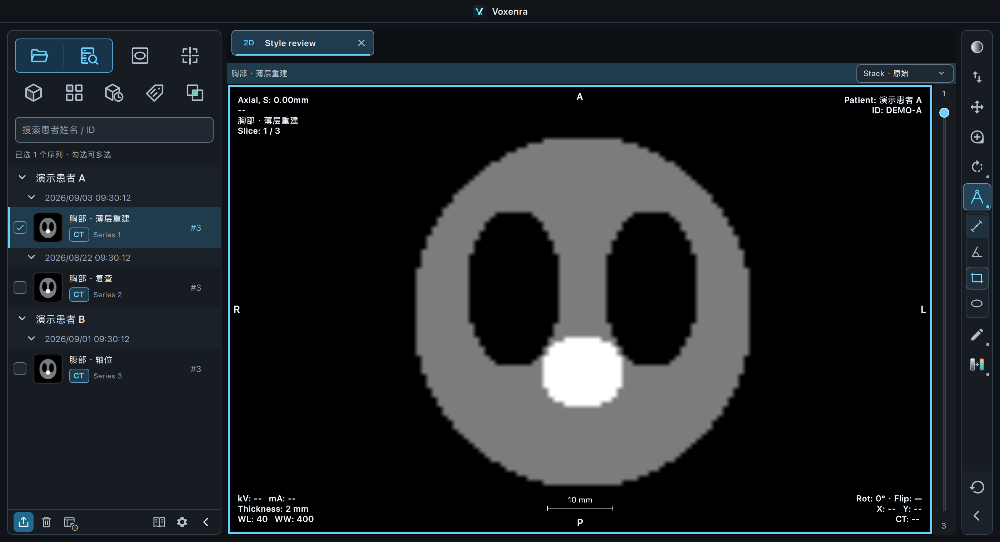
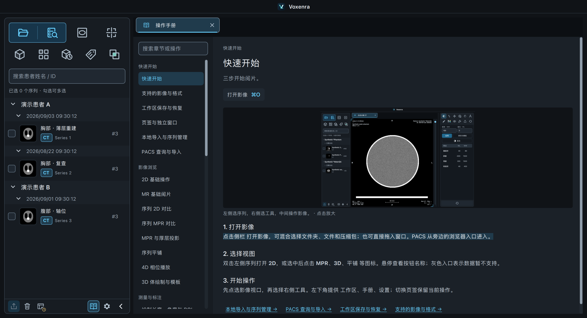
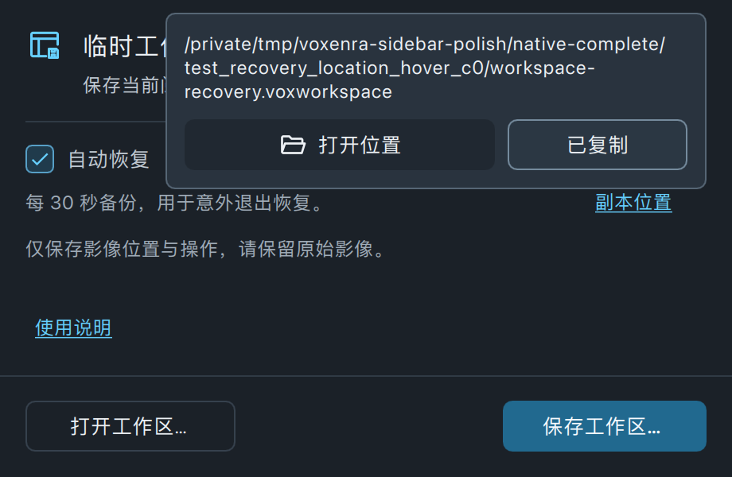
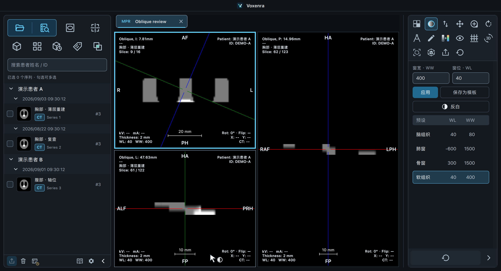
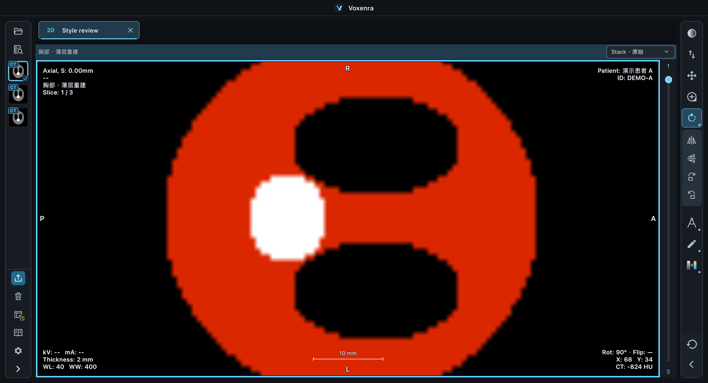
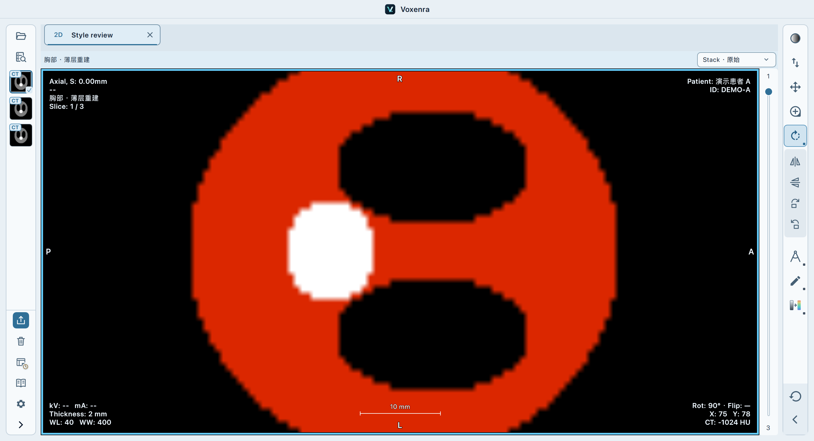
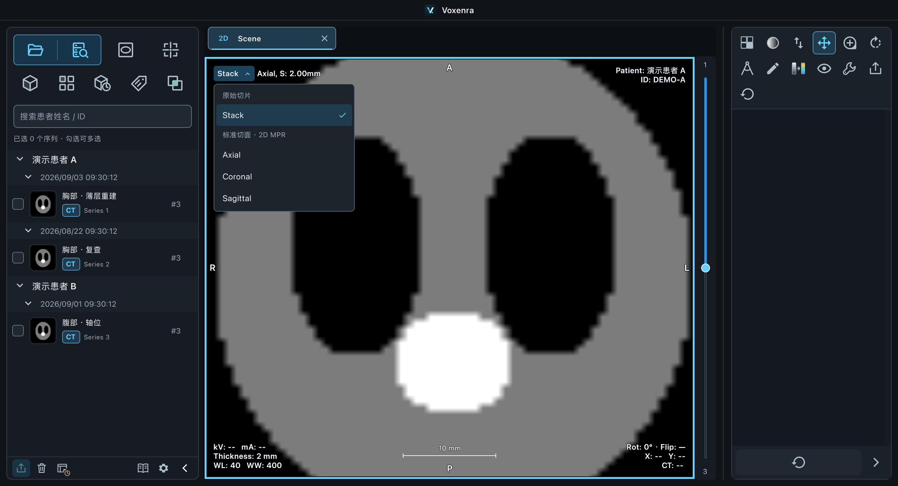
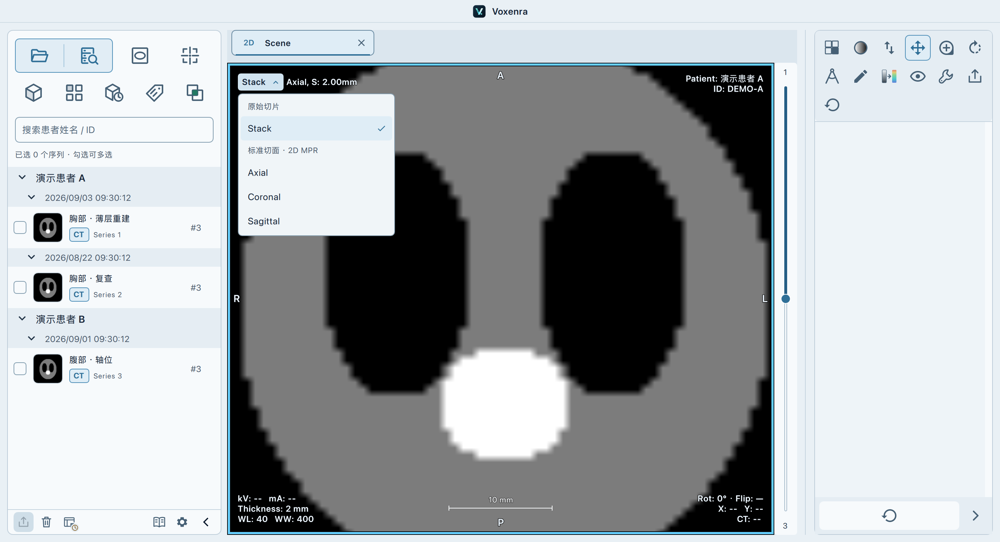
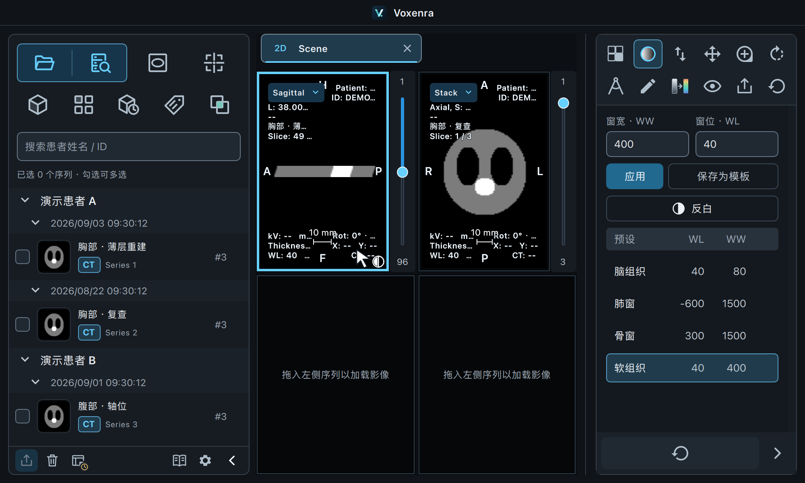
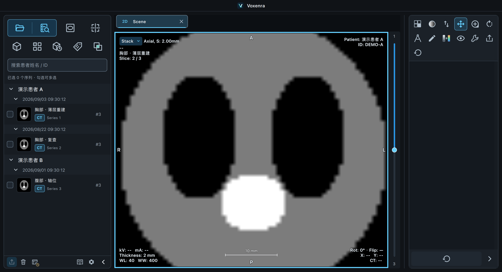

# 侧边栏与视图名称验证 · 2026-09-15

基于 `main` 的 `29bf6e3` 创建独立 worktree，分支为 `codex/sidebar-style-polish`。

## 本次行为

- 侧边栏提示在首次显示前确定位置，点击入口后关闭；左栏提示显示在右侧，右侧紧凑工具提示显示在左侧。
- 左栏收起后保留导出、清除、工作区、手册、设置和展开按钮。患者／检查分组箭头增至 20 像素；CT、MR、PET 使用高亮模态标识。
- 去掉「删除所选序列」菜单，保留「从列表移除」。后者移除右键所指的列表项，不删除源文件；旧批量入口作用于勾选集合。
- 右侧紧凑工具栏保留直接工具，并提供测量、旋转、标注、伪彩分组。点击在下方展开二级图标，一次展开一组；按钮随视图能力显示。
- 悬停或点击「副本位置」显示完整路径和打开／复制按钮。鼠标停留在链接、移入卡片后均保持显示；离开后关闭。打开按钮关闭卡片并打开所在文件夹，工作区窗口保留。
- 手册去掉内容区重复的「操作手册」标题，正文、标题及截图说明可选中复制。
- 四角位置名称按实际切面法向确定：标准方向显示 Axial、Coronal、Sagittal，斜切面显示 Oblique。0.1° 容差处理方向余弦舍入。十字线与联动 3D 旋转更新名称，回到标准方向恢复名称；独立 3D 相机旋转不改变切面名称。

## 验证结果

| 范围 | 结果 |
| --- | --- |
| 全量离屏回归 | 1526 通过，50 跳过，无失败 |
| 最后一次卡片修正后的 macOS 原生检查 | 24 通过，1 跳过，无失败 |
| 同一修正后的关联离屏检查 | 23 通过，2 跳过，无失败 |
| 资源与差异检查 | 新增四个 QML 组件均登记到资源清单；无空白错误 |

原生检查覆盖首次提示位置、连续悬停、鼠标移入卡片、复制路径、打开后关闭、紧凑工具对实际视图状态的修改、手册复制、标准／斜切面切换及逆向恢复。全量测试输出包含现有 VTK／NumPy 弃用提示及合成 DICOM 未知 VR 提示。平台相关测试按条件跳过，未进行 Windows 原生窗口实测。

另通过桌面界面导入本地 MR `T1_mprage_ns_sag_p2 [TE=4.11]`（192 层），检查 MR 高亮、左右窄栏、测量二级图标、BlackBody 伪彩及复位。源数据本身为斜采集方向，原始视图正确显示 Oblique。修正后再次通过实际窗口点击复制与打开，确认卡片关闭且访达打开 `voxenra-sidebar-polish` 临时目录。

验证时发现并修复了路径卡片使用原生弹窗导致悬停丢失、250 毫秒后自行关闭的问题。卡片现与链接共享窗口，连续悬停检查已加入回归。自动化截图使用合成 CT 数据。

## 截图

### 紧凑侧栏和测量二级操作

### 可选择复制的手册正文

### 副本完整路径和操作卡片

### 切面旋转后显示 Oblique

## 后续样式反馈

二级操作改用无边框的背景分组，与下方一级按钮增加 10 像素间隔。深浅主题分别使用钢蓝灰背景。左侧缩略图角标字体由 11 缩至 9 像素，高度由 16 缩至 13 像素。

收起栏底部固定为「重置所有」，复用一级重置命令；展开后二级面板仍只重置当前工具。新增检查在选中平移工具时，同时验证平移、缩放、旋转、伪彩和测量全部恢复，深浅主题原生检查均通过。相关工具栏回归 69 项通过；一次手册异步创建提示单独复跑手册后 10 项全部通过。原生二级工具及重置检查 3 项通过。

## performance 导入兼容性验证

用户指定的 `Documents/test_dicom/performance` 包含 32 个单帧 CT DICOM，矩阵为 1024 × 1024。正文 SOPInstanceUID 仅有 1 个值，但文件头 MediaStorageSOPInstanceUID、切片位置及像素内容各有 32 个不同值。旧扫描仅按正文编号去重，因此误跳过 31 张。

来源实例现在由正文与文件头编号共同区分；编号一致的标准文件保持原有去重效果。原始文件和展示的原始编号不修改。扫描、增量合并、Tag 分页及工作区保存恢复使用一致的来源标识。旧工作区未保存文件头编号时，只有保存的几何信息能唯一对应文件才恢复，避免在多个候选中猜测。

| 实测项目 | 结果 |
| --- | --- |
| 实际导入窗口 | 1 个序列，32 个 DICOM，0 个跳过 |
| 逐张像素解码 | 32 张成功，32 个不同像素结果 |
| 额外加入一份完全相同的文件副本 | 保留 32 张，只跳过 1 份副本 |
| 实际数据工作区保存／恢复 | 32 张，来源标识和顺序保持一致 |
| 原文件哈希前后校验 | 32 个文件全部不变 |
| 桌面阅片 | 首层、中间切片正常显示，列表和图像均显示 32 层 |
| 最后关联回归 | 88 通过、3 跳过、无失败 |

新增合成样本回归覆盖来源编号冲突、真正的重复副本、分批合并、再次导入、Tag 分页、新旧工作区恢复和旧工作区来源不明确的情形。全量检查其余 1532 项通过；新增旧工作区样本最初缺少空间位置而被正确判为无法唯一匹配，补齐不同切片位置后通过，并另保留了拒绝猜测来源的回归。最终关联回归包含全部新增场景。

本次兼容针对这批数据的两处编号不一致情况；未修改用户数据，也不推测其他软件内部的去重规则。

## 2D 左上角视图切换

- 删除 2D 各视口原来高 30 px 的顶部栏，入口移入影像左上角；单视图、多视图、临时放大使用相同位置。
- 常驻标签和菜单均使用英文全称 Stack / Axial / Coronal / Sagittal，按“原始切片”和“标准切面 · 2D MPR”分组，始终操作当前单元格的同一源序列。
- 四角字段设置与毫米位置保留；窄视口将位置移到下一行，原有字段顺序自定义仍然有效。隐藏四角信息后菜单继续可用。
- Stack 保留实际方向信息，包括斜位 MR 的 Oblique。重建失败时，入口仍可返回原始切片。
- 导出图像包含纯文字模式及原有信息，不包含交互按钮、箭头或菜单；匿名导出继续隐藏四角信息。
- 修复多视图临时放大后切换方向导致所有单元格隐藏的问题：焦点跟随该单元格的新视图。
- README、中英文离线手册、Markdown 操作手册已更新。

验证结果：

- 相关回归 100 项通过（2D 布局、切换、显示范围、四角信息、导出、MR、MPR/PET/4D 选中框与手册）。记录：`/tmp/voxenra-sidebar-polish/selector-regression.xml`。
- 最终窄视口排版调整后，macOS 原生 Qt 鼠标／键盘界面检查 9 项通过。覆盖实际菜单点击、各模式状态保留、隐藏／自定义四角信息、导出、多视图／放大、MR 斜位及重建失败恢复。记录：`/tmp/voxenra-sidebar-polish/selector-final-native.xml`。
- 本地 CT 原生界面检查 2 项通过：螺旋mtf（20 张）完成 Stack → AX → COR → SAG → Stack，回到第 5 张；performance（32 张）验证错误提示及返回第 5 张原始切片。记录：`/tmp/voxenra-sidebar-polish/selector-local-ct.xml`。
- performance 的相邻层法向间隔约 0.6 mm，但部分层存在约 0.01 mm 的平面内位置差，触发现有规则体数据校验。本次未放宽重建条件、未更改文件几何；原始切片可正常浏览。螺旋mtf 的源元数据另有无效 IS 字段警告，未影响本次切换验证。
- CUA 确认了 performance 原生窗口的左上角入口和四角信息；其坐标操作连续返回 `noWindowsAvailable`，后续完整交互由上述原生 Qt 界面测试完成。
- 未运行全量测试；本轮仅运行与修改相关的回归。`git diff --check` 通过。

以下均为合成 CT 的原生界面截图，未将用户 CT 数据或截图复制到仓库。

## 全称与 performance 数量复核

视图入口和菜单项统一显示 Stack、Axial、Coronal、Sagittal，不再中英并列。清除默认上下内边距对按钮及菜单行文字的影响，使文字和箭头／勾选标记在对应行垂直居中。README 与操作手册同步更新。上述三个合成影像截图已替换为最新全称样式。

- 全称修改后，macOS 原生界面检查 7 项通过，记录：`/tmp/voxenra-sidebar-polish/selector-full-names.xml`。
- 本次读取 `Documents/test_dicom/performance`，实际为 32 个单帧 DICOM；扫描得到 32 张、跳过 0 张。
- CUA 读取小赛当前同一序列，左侧显示 `CT #32`，影像显示 `Im: 1/32`。
- 在当前 worktree 的原生窗口逐张切换第 1～32 张，逐张等待渲染完成并核对四角编号；32 个图像源均不同，最后显示 `Slice: 32 / 32`，没有复现 20 张截断。记录：`/tmp/voxenra-sidebar-polish/performance-all-frames.xml`。
- 第 1、20、32 张的实际 performance 截图仅保存于 `/tmp/voxenra-sidebar-polish/performance-all-frames/test_performance_browses_every0/`，没有复制到仓库或源数据目录。
- 上一轮展示的 `#20` 截图来自另一个“螺旋mtf”序列；不能将该截图的数量当作 performance 的导入结果。用户所述另一次 33／20 的差异尚需确认其目录或具体显示位置，未据此修改导入去重规则。

## 视图选择高亮与对话框关闭行为

- 2D 选择器使用淡青色背景与高亮箭头，悬停、聚焦或展开时增强底色；保留 Stack / Axial / Coronal / Sagittal 全称与垂直居中。增加文字左边距并同步预留宽度，窄视口位置换行和导出纯文字信息保持有效。
- 取消导入结果窗口的统一 4 秒计时。只有完整、无跳过且无已存在文件的导入在后台线程结束后立即关闭；重复、非 DICOM、取消、空输入和失败结果保留，点击“确定”关闭。重复导入已有序列也显示已存在文件数，Enhanced MR 按文件而非帧/分组计数，补入缺失帧不会误报整文件重复。
- 点击工作区“恢复”或“丢弃”时先关闭窗口，再处理操作；替换确认取消时保留副本，恢复失败或缺失来源时仍可重新显示窗口。重新定位/跳过缺失来源流程保持原语义。
- 本地导入说明、工作区说明和中英文内置手册同步更新。

验证：macOS 原生 Qt 窗口交互 **40 passed**（导入正常/重复/混合/非 DICOM/空输入/损坏包/取消/重试，系统标题栏关闭，恢复/丢弃和恢复错误，以及 2D 切换与导出）；UID 冲突、Enhanced MR 和手册回归 **33 passed**。这次未重跑全量测试。数据测试中的 8 条警告来自 VTK 与 NumPy 的弃用提示，无测试失败。`git diff --check` 通过。

测试记录：`/tmp/voxenra-sidebar-polish/dialog-behavior-native.xml`、`/tmp/voxenra-sidebar-polish/dialog-data-regression.xml`。以下截图来自合成影像的原生窗口，未修改截图：

深色/浅色菜单和多视口截图已更新：`2d-menu-dark.png`、`2d-menu-light.png`、`2d-multiview.png`。
