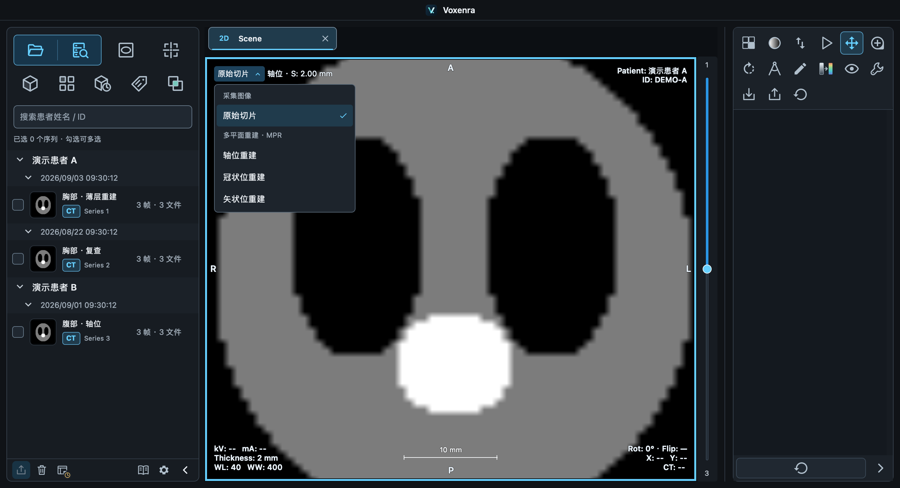

# 2D 查看方式与实际方向（2026-09-17）

## 设计

- 查看方式使用“原始切片 / 轴位重建 / 冠状位重建 / 矢状位重建”，菜单区分采集图像与多平面重建。
- 原始切片旁显示实际方向，例如“轴位 · S: 2.00 mm”；重建切面旁省略重复的标准方向，只显示位置。斜位仍明确显示，缺少几何信息显示“方向与位置未知”。
- 方向与位置取自当前帧几何，不根据所选菜单推测。位置悬停说明解释患者坐标、单位以及斜位距离，区分层厚和切片序号。
- 常规尺寸单行显示；较窄视口的模式文字换行，位置移至下一行，仍受四角信息区域宽度限制。极窄视口的长位置可通过悬停查看完整值。
- 控件及悬停说明在图像导出范围外。PNG 保留纯文本查看方式与位置，匿名导出沿用隐藏信息的规则。
- 手册、中英文语言包、README 和版本说明同步更新。

## 验证

- 离屏回归 **55 项通过**：`test_two_d_selector.py`、`test_two_d_layout.py`、`test_dicom_overlay.py`、`test_appearance_language.py`。
- macOS 原生 Qt：选择器测试的 **10 个用例全部通过**（9 项首次通过；导出悬停用例修正测试对象查找及鼠标引起的像素变化后单独通过）。
- 实际菜单切换、中英文及深浅主题、实时语言切换、四格窄视口、斜位 MR、缺少空间信息的 MR、重建失败后返回原始切片。
- 切换后保持原始切片位置、测量、缩放；四角信息隐藏/排序有效，其他工作区四角字段保持英文；导出逐像素验证控件与悬停说明均未进入图像。
- 人工查看原生截图：中英文菜单、浅色原始切片、窄视口换行。测试影像为合成数据。
- 本次未修改像素读取、重建或患者坐标计算，未新增 Slicer 对照。

运行记录及其余截图保存在本地 `build/validation/two-d-design-*`（不提交）。
