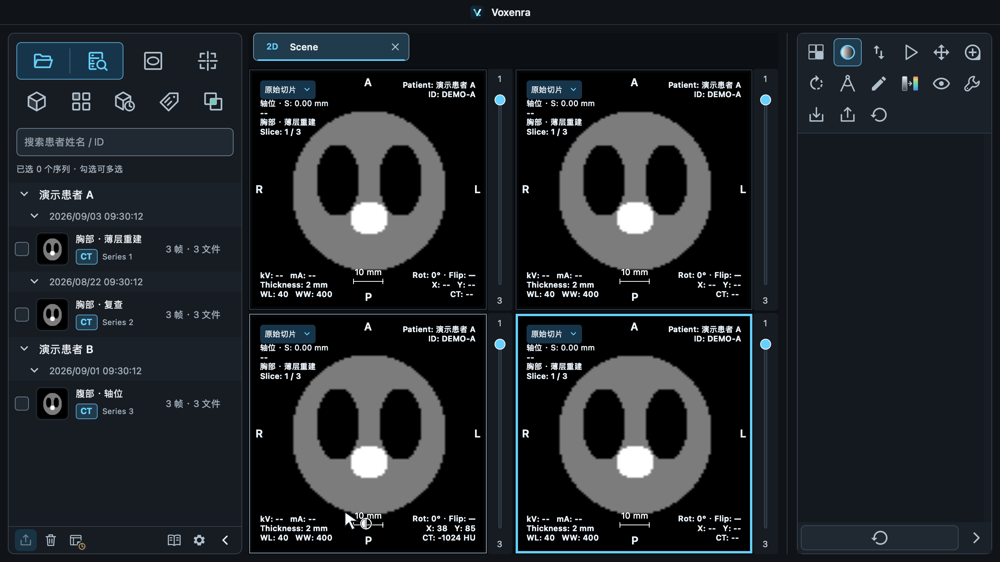

# 默认窗口与最小阅片空间（2026-09-17）

## 尺寸方案

以下均为 Qt 逻辑像素，2× Retina 屏幕截图的物理像素会翻倍。

| 区域 | 默认 | 常规下限 |
| --- | --- | --- |
| 主窗口 | 1440 × 900 | 1280 × 720 |
| 独立窗口 | 1120 × 840 | 960 × 720 |
| 中央阅片区域（不含页签栏） | 随窗口伸缩 | 640 × 520 |

旧窗口为 1400 × 760、最小 1000 × 600，中央只限制 360 宽。新尺寸增加纵向空间，四格模式在最小主窗口下仍能显示完整模式名称及基本信息。中央下限约束整个阅片区域；自定义多格布局仍共享此区域，可双击放大单格。

- 侧栏调整宽度不能挤占中央保留空间。侧栏暂时受限时保留已保存的展开宽度。
- 启动窗口按当前屏幕可用桌面居中；考虑系统窗口边框，不越过可用区域。跨屏、可用区域变化及还原窗口时重新约束。
- 屏幕不足时降低窗口下限至可用范围，临时收起序列栏或工具栏。空间恢复后还原偏好；不可展开时按钮禁用并提供原因。极小屏幕以实际可用空间降低中央下限。
- 原生拖动和程序恢复都遵守同一下限；全屏和最大化保持系统行为。

## 验证

- 离屏相关回归 49 项通过、1 项需原生环境而跳过：窗口、页签移动、侧栏、2D 选择器以及尺寸边界。新增屏幕生命周期与语言包完整性检查另 2 项通过，共 51 项通过。
- macOS 原生验证 11 个不同用例通过：7 个尺寸/屏幕生命周期用例、侧栏宽度恢复、窗口标题栏、深浅主题的全屏/最大化/还原/最小化/关闭。小屏幕恢复测试等待原生布局完成后通过。
- 本机 2× 显示器逻辑桌面：内置 1710 × 1107（可用 1710 × 1073），外接 1920 × 1080（可用 1920 × 1050）。
- 模拟可用区域 1366 × 728、1024 × 700、800 × 600，检查窗口完全位于区域内、中央空间、自动窄栏和设置恢复。小屏幕测试使用真实 Qt 布局与模拟桌面边界。
- 查看原生最小四格和小屏幕截图。Windows 原生桌面本轮未实测。
- Ruff 与 `git diff --check` 通过。

## 屏幕对象生命周期

验证中复现 PySide 6.11 的 `QWindow.screen()` 包装对象归属问题：包装对象被关联到窗口，销毁窗口后共享屏幕包装失效，可能在创建后续窗口或进程退出时崩溃。尺寸管理和分离窗口改从应用级接口获取屏幕；新增反复创建、销毁窗口并检查共享屏幕仍有效的回归。尺寸计时器随窗口持有，关闭时明确断开监听并停止计时器。修正后相关回归与原生测试正常退出。

其余截图与运行产物在本地 `build/validation/window-sizing-*`，不提交。
